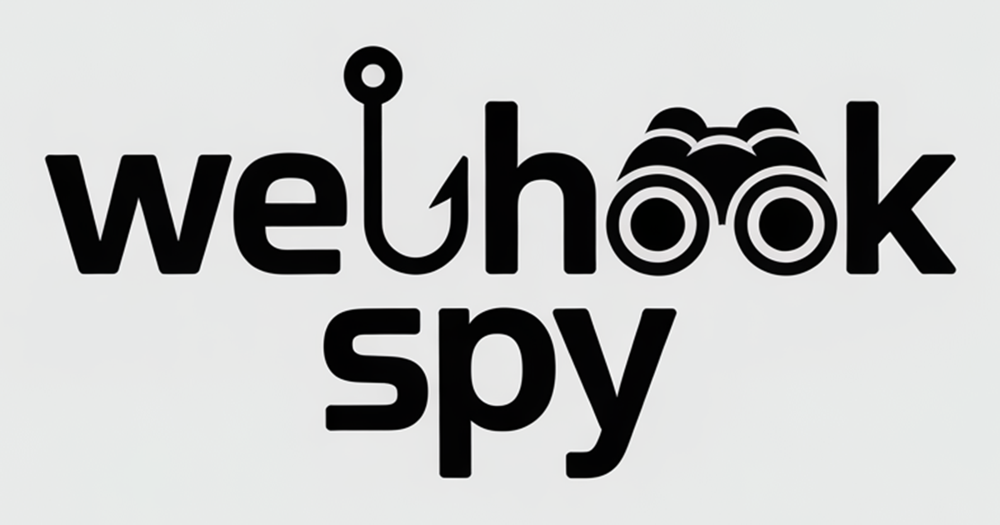

At work, we've been using a self-hosted version of Webhook.site. It hasn't been
a great experience. I won't go into the details, but let's just say it left me
wondering: how hard could it be to build a simple webhook tester that covers 95%
of use cases?

Turns out, not very hard at all—especially with AI assistance.

## From Idea to Working Prototype

I spun up [OpenAI Codex](https://openai.com/index/openai-codex/) and gave it a
simple prompt describing the tech stack I wanted and the core functionality. It
built me a solid proof of concept in no time.

From there, I moved to [Claude Code](https://claude.ai/code) to iterate on
features and refine the UI/UX. After just a few hours, I had something fully functional and
deployed to production.

## What is WebhookSpy?

WebhookSpy is a free tool for testing webhooks. It generates a unique URL that
you can use as a webhook endpoint. When a request hits that URL, you can see all
the details—headers, body, query parameters, and more—in real time.

It's simple, fast, and does exactly what you need without any fuss.

## Discovering Elysia

One unexpected bonus from this project was discovering
[Elysia](https://elysiajs.com/)—a web framework built on
[Bun](https://bun.sh/). It's incredibly fast and has one of the cleanest APIs
I've worked with. Best of all, it automatically generates beautiful API
documentation with minimal configuration.

If you're looking for a modern, performant alternative to Express or Fastify,
Elysia is worth checking out.

## Open Source and Self-Hostable

WebhookSpy is completely open source. The codebase is well-documented, so you
can:

- **Contribute**: Found a bug or have a feature idea? PRs are welcome.
- **Self-host**: Need to keep your webhook data on your own infrastructure? Spin
  up your own instance.

Check out the [GitHub repository](https://github.com/djedi/WebHookSpy) for
documentation and setup instructions.

## AI-Assisted Development

This project is a perfect example of how AI can accelerate the development
process. What might have taken days or weeks to build from scratch took just a
few hours with the right AI tools. Codex handled the initial scaffolding, and
Claude helped me polish the experience.

I'm not saying AI wrote perfect code—there was plenty of back-and-forth and
manual tweaking involved. But the speed at which you can go from idea to
deployed product is remarkable.

## Try It Out

Do you have a webhook to test? Give it a spin at
[WebhookSpy.com](https://webhookspy.com). It's free to use and requires no
sign-up. Or grab the source and host it yourself.
