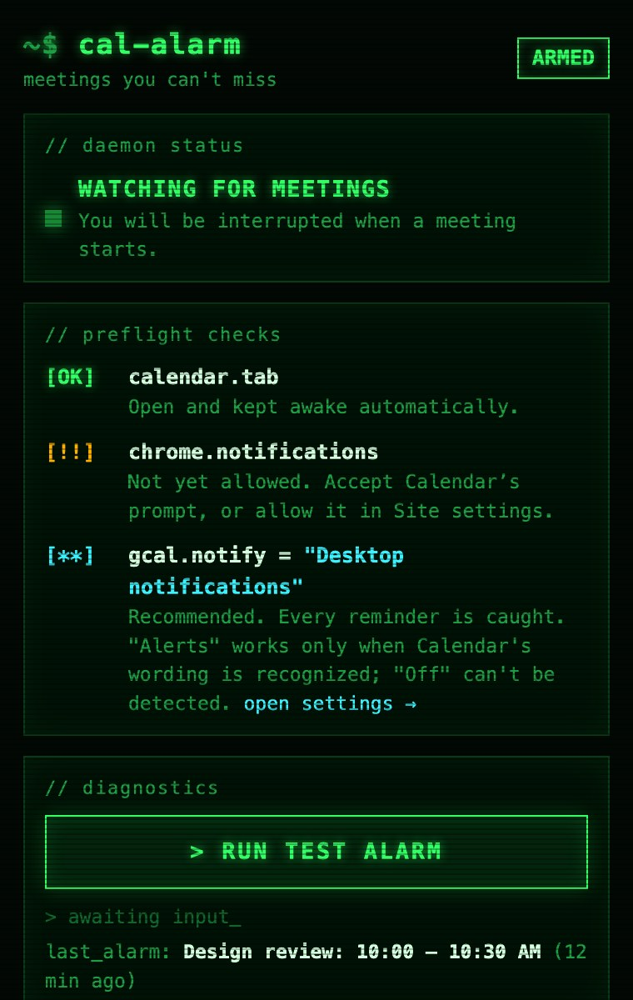

I have a confession: I'm really good at missing meetings.

It's not because I forget they exist. I usually know I have a meeting at 10:00. Then I start working on something at 9:40, and the next time I look up, it's 10:07. Google Calendar *did* remind me. It showed a polite little notification in the corner of my screen, and I didn't see it. I was in my editor, or a terminal, or deep in some other tab.

A reminder that disappears while you're focused isn't much of a reminder. I needed something closer to an alarm clock. So I built one.

## The tools that exist want the keys to your account

I'm not the first person with this problem, and there are tools that try to solve it. Most of them work the same way: sign in with Google, grant access to your calendar, and let them read your events so they can remind you.

I get why they do it that way. But I don't love giving a browser extension or a third-party service ongoing access to my Google account just so it can tell me that a meeting is starting. My calendar says a lot about my life: who I meet, when, and what it's about. It's also often a work account, which means that access might not even be mine to give. Many companies block third-party apps from connecting to Google Workspace accounts entirely, or make you request special approval from IT first. That's a lot of hassle for a meeting reminder.

Google Calendar already knows when my meetings are. It already sends reminders. The problem isn't that the information is missing; it's that the reminder is too easy to miss.

## Calendar Alarm just makes the existing reminder impossible to ignore

That's the idea behind [Calendar Alarm](https://github.com/djedi/gcal-meeting-alerter), a Chrome extension I wrote to stop missing meetings.

It doesn't ask for your Google credentials. It doesn't use the Google Calendar API. There's no account, no server, and no analytics. It runs on `calendar.google.com` and listens for the reminders Google Calendar already shows in your browser.

When one fires, Calendar Alarm takes over:

- It opens a **full-screen, focused alarm window**. It isn't a toast in the corner, and it doesn't quietly disappear.
- It **chimes every few seconds** until you respond.
- Press <kbd>Enter</kbd> to jump straight to your Calendar tab, or <kbd>Esc</kbd> to close the alarm.
- If you need a minute, you can **snooze** it for 30 seconds, 1 minute, 90 seconds, or 2 minutes.

Everything happens locally in your browser. Your reminder text doesn't leave your machine.

## It even keeps Calendar open for you

This approach has one catch: Google Calendar only sends browser reminders when a Calendar tab is open. If you close that tab, or Chrome puts it to sleep to save memory, the reminders stop.

So Calendar Alarm handles that too. If no Calendar tab is open, it opens a pinned one in the background. It also tells Chrome not to put Calendar tabs to sleep. You can turn this behavior off, but I leave it on because it means I don't have to think about it.

The toolbar popup includes a small setup checklist. It shows whether a Calendar tab is open and whether Chrome is allowed to show notifications for Calendar. There's also a button to run a test alarm, so you know it works before a real meeting depends on it.

Yes, it looks like a terminal from a 90s hacker movie. I built it for developers, and I figured a meeting alarm might as well be fun to look at.

## One setting makes it work best

In Google Calendar, go to **Settings → Notification settings** and set **Notifications** to **Desktop notifications**. Calendar Alarm catches every reminder sent that way.

The **Alerts** setting works too, but Calendar uses the same kind of popup for other messages. Calendar Alarm only responds to alerts that clearly look like reminders. If notifications are set to **Off**, Calendar doesn't show anything in the browser, so there's nothing for the extension to catch.

## Try it

Calendar Alarm is free and open source under the MIT license. It's currently in review for the Chrome Web Store. In the meantime, you can load it from source in about a minute:

1. Clone [github.com/djedi/gcal-meeting-alerter](https://github.com/djedi/gcal-meeting-alerter).
2. Open `chrome://extensions` and turn on **Developer mode**.
3. Click **Load unpacked** and select the folder.
4. Click the toolbar icon and run the test alarm.

I've been using it every day, and I haven't wandered into a meeting seven minutes late since. If you have an idea for a feature, or it saves you from missing something important, let me know on X at [@DustinDavis](https://x.com/DustinDavis). I'd love to hear about it.
