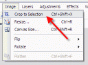

I'm really liking [Paint.net](http://www.getpaint.net). I can't afford Photoshop
and so I resorted to using free alternatives such as
[GIMP](http://www.gimp.org/windows/) and [Paint.net](http://www.getpaint.net).
There has been a slight learning curve though as I've had to get used to these
free tools.

One thing I found missing that I would often use in Photoshop is the trim
function. This essentially allows you to remove the extra blank space or white
(or whatever color you choose) space around an image.

I've found a simple workaround to do what I need though.

Here it is, step-by-step:

Use the magic want to select the outside portion you want to trim.  
  

Invert your selection:  
  

And finally, crop to selection:  
  

