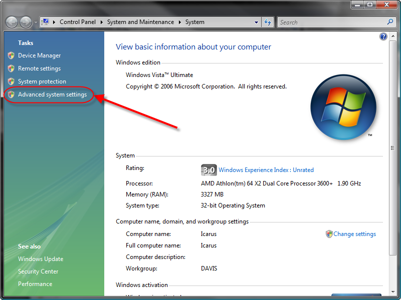
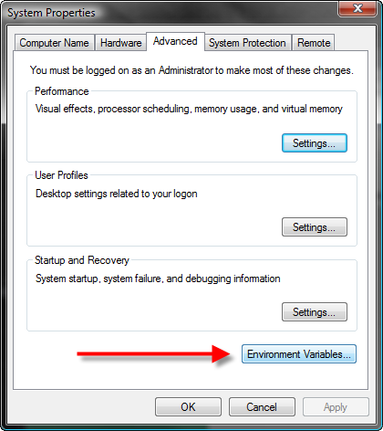
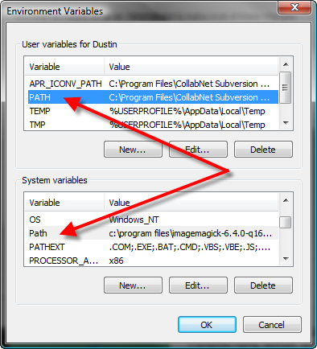
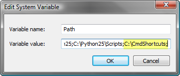

## Update

I haven't used Windows for over a decade, but this page gets a lot of hits, so I
leave it here assuming and hopeful it is helpful.

--

I find it quite annoying that whenever I read instructions that include adding
an environment path variable you are asked to reboot your machine for changes to
take effect. I know there has GOT to be a way to do it. Well, I know a way, but
it's someway kludgy.

Here is how I do it (I'm really hoping someone will comment and tell me a better
way)

1. Open your system properties window. Screenshots below are for Vista:
   
2. Open you Environment Variables Window.
   
3. Double Click on you Path (if you want to just change you path for your login,
   use the top one, if you want to change it for all logins, use the bottom one)
   
4. Append the path you would like to add, separated with a semi-colon. Below, I
   am adding C:\CmdShortcuts 

...

Now, reboot your computer! Argh! J/K

Here is the kludgy hack that I use so I don't have to reboot. (But it will not
work in all cases, which is why I don't like it, so please, if you know of a
batch script or something I can run that will apply the changes made to the
environment variables without rebooting, please post a comment.)

Open a comment window and type `SET PATH=%PATH%;C:\CmdShortcuts`

You can type PATH again to see your path variables. Your new path should be
added. The problem with this is that this new path variable is only good inside
this command window. If you are doing command line stuff this works, but if you
close your cmd window the change is lost.
