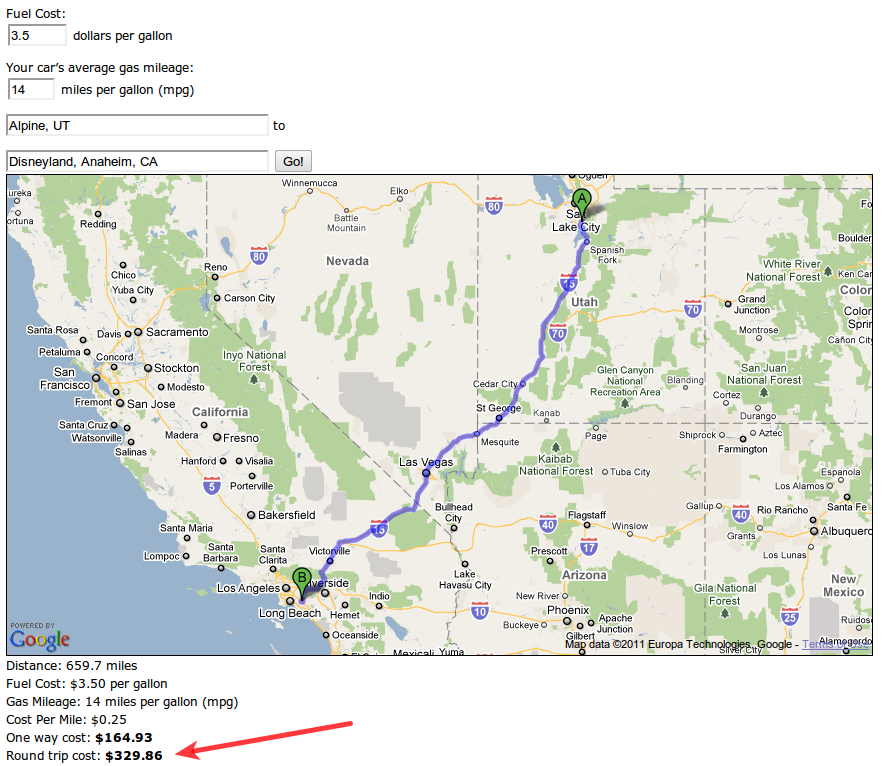

I love Disneyland. My in-laws took our family 3 years ago and we had a blast. We
went again just over a year ago and met my parents there. It wasn't quite as fun
the second time just because we all got very sick with fevers, body aches and
the whole nine yards.

Plus, the last two times we went were during the holiday season. The first time
was between Christmas & New Year's. The second time was about a week & a half
before Christmas. Both times the place was completely packed. There were signs
up saying Disneyland/Calfornia Adventure were sold out! I'm going to go out on a
limb and guess that Disneyland is much more fun when it is not so packed.

I'm getting to the point where I want to go back. We had a baby last September
so we are waiting until he is older. Our first time we went our youngest was 4
months old. He got very sick and when we returned home he developed RSV and had
to spend a few nights at the children's hospital. That was NOT a fun ordeal. I
figure one year old would be a decent age. He won't be nursing anymore and will
be a little easier to manage. Plus, if you take a child before they turn 2, they
get into Disneyland free.

We live in Utah. The past two times we have flown. It seems odd, but doing the
math, it cost about the same to fly as it did to drive. But next time, I think
we will drive anyway. Why? First of all, I hate what the TSA is doing with their
groping security theater. This is my way of protesting. Other benefits of
driving include:

- Our kids can handle a long drive better than a plane flight. We put in a DVD
  in the car and they are entertained. Our last flight had TV's in the back of
  the seat, but we had no control over what was available to watch.
- We can stop and take breaks when we need to.
- Less stress. It can be stressful going through all the airport security and
  make sure you get everything you need in place & on time.
- Road trips can be fun & memorable.
- Our luggage doesn't leave our site & our control.
- We are not limited as much to the amount or weight of luggage.
- More freedom to travel. We don't have to worry about catching a shuttle or
  taxi if we need to leave the Disneyland area.

All in all, with 4 small kids, driving just seems like the way to go this time
around. Perhaps when they are older and the government wises up and gets rid of
the TSA it will make more sense to fly again.

I've determined from
[Google Maps](http://maps.google.com/maps?f=d&source=s_d&saddr=alpine,+ut&daddr=Disneyland,+Anaheim,+CA&hl=en&geocode=FaNEaQIdPmdW-Sl1nQYV1IBNhzGLyxgG0XVh9Q%3BFdDqAwIdTaf4-CmhS7LK19fcgDEIaO0fq0RPxg&mra=ls&sll=33.811152,-117.921971&sspn=0.025281,0.048752&g=Disneyland,+Anaheim,+CA&ie=UTF8&t=h&z=6)
that it will take about 10 1/2 hours to drive there.

## When To Go

Like I touched on earlier, I really have no desire to go on a crowded day again.
My friend send me
[this link](http://www.scottware.com.au/theme/feature/atend.htm) that shows the
best times to go to Disneyland if you want to avoid the crowds. I'm thinking
sometime between September & October will be ideal. My youngest son turns 1 in
September and my 3-year-old turns four in September. So mid to late September
ought to be ideal. Plus, it is not nearly as hot as the summer months.

I am not concerned about taking kids out of school or taking time off work.
School work can be made up, and that's what work vacation days are for. Memories
made on vacation are more valuable in my mind than a routine school or work
days. So, also to avoid busy crowds I would leave on a Monday or Tuesday.
Weekends are generally more crowded, plus, I may be a bit prudish, but I just
don't like vacationing on the Sabbath. It doesn't _feel_ right and therefore
sort of spoils the vacation for me.

The first time we went we had a 3 day hopper. The second time we had a 4 day
hopper. Honestly, the second time we were done and ready to go home after 3
days. Four was just a bit too much. I'm sure being sick with 3 small, sick
children had **a lot** to do with that sentiment, but still, if the park is not
crowded, 3 days should be plenty to do and see all you want.

So given the estimation of 10 1/2 driving hours (plus time for rest stops,
lunch, etc) two whole days will be dedicated to traveling. So with 3 days in the
park, that makes this a 5-day vacation. Knowing that I don't want one of these
days to be on Sunday, that gives us two options: Monday through Friday, or
Tuesday through Saturday. I don't have to make this decision yet, but I'm
leaning towards Tuesday through Saturday mostly because I have heard that when
it is not busy season,
[Fantasmic](http://disneyland.disney.go.com/disneyland/fantasmic/) only shows on
weekends. That would give us a chance to watch Fantasmic (which I haven't seen
yet) on Friday night.

## Budgeting For the Trip

Now, the really important stuff - how much is this going to cost? I recommend
getting out a spreadsheet and planning all our you expenses before any vacation,
then saving up and paying with cash!

Let's start with travel. Using [a tool I wrote](/blog/trip-fuel-cost-calculator)
a few years ago. I can estimate the cost of fuel to make the trip. I enter the
average cost of a gallon of gas, my average mile per gallon my vehicle gets, my
starting location and my destination. Google's map API will determine the
distance and I get a one-way and round trip cost estimate. According to the
[fuel trip cost calculator](/blog/trip-fuel-cost-calculator), it will cost about
$330 in fuel (we have a big SUV). I will round that up to $350 for a more even
number. I always like to round up a bit.

Next is the hotel stay. The first time we stayed at the Disneyland Hotel. It was
very nice, and it was fun walking through Downtown Disney, but the real
excitement is the park, not the place you sleep. So a hotel is a hotel, or is
it? The second time we booked a reservation at the
[Anaheim Plaza](http://www.anaheimplazahotel.com/). The Anaheim Plaza is across
the street from Disneyland and probably the cheapest place you will find so
close to Disneyland. Unfortunately, we hated it. Our room was dirty, hot, muggy,
& stinky. They had turned off the A/C for the winter season in our building. The
tub was clogged so we took a shower standing in dirty water. We asked for a
rollaway bed and they never brought it. It was just an all-around bad
experience. But, my parents & younger sister stay there every time they go and
they like it, so your mileage may very. It was so bad for us that I canceled our
remaining nights and walked down the street to find something better. We ended
up re-packing and waking our luggage down the street to the
[Best Western Park Place Inn](https://parkplaceinnandminisuites.com/). It was so
much nicer. It was cleaner. It was updated. It was closer to the main gate -
just right across the street. We got a room with two queen beds and a hide-away
queen bed. So it can fit a family of six.

If we were to stay at the Anaheim Plaza we would need a family suite (basically
two rooms connected with a door separating them. We can get that for
$109 per night. For 4 nights that is a total of $436. If we were to stay at the
Best Western Park Place Inn again, the standard rate for the same room we had
before would be
$134 per night. I know that last time I got a discount using my Costco card. Plus, I noticed on the internet that if you book 21 days in advance, you can get the room for $107.20.
That makes that decision way too easy. On top off that, it includes free WIFI
(Anaheim Plaza is
$10 per day) and free continental breakfast, which with a family of 5 eating would save us almost $50
per day if we chose to eat breakfast at the Anaheim Plaza. So, moral of the
story, don't take room prices at face value!

Now, for the important part - the Disneyland park hopper passes. They will cost
$152 each for 3 of our children and $169 each for my wife and I. That's a total
of $794 - close to $800.

So, between travel, hotel, and passes we're up to roughly `$1600` (rounding up).
Now we need to plan for food. Remember that we already have breakfast covered.

One of our neighbors told me that when they drive to Disneyland they pack a
cooler full of sandwiches to eat on the way there and for lunches while there.
We have done this before on a trip to a Colorado Rockies game. It's not a bad
idea. If we plan on leaving Tuesday morning we can spend Monday night making
sandwiches for the upcoming week and packing them in our cooler. The hotel has a
mini-fridge and microwave so we can plan on using them as needed.

Still, eating out can be a fun part of the whole trip so I don't want to eat
sandwiches for every meal. I figure we could spend
$150 on grocery items for making sandwiches and packing chips, crackers, & other goodies. Then I would plan $250
for eating out. That would give us
$50 per day for eating out. That's basically one meal at a restaurant for a family of five. Then I would give us $150
for treats & refreshments inside the park. Again, that is `$50` for each day we
are in the park.

All of these we could definitely save money if we mostly eat from the groceries
we buy before hand. But I'm guessing from past experiences we will want to eat
out on occasion. I think this budget gives us quite a bit of wiggle room. So for
food, I will plan for $550, which gives us a grand total of $2150.

Now, lastly, who can visit Disneyland without picking up some souvenirs? This is
where we went way overboard last time. But, the last time my mom gave each of
the kids
$50 to buy toys and souvenirs, so that really helped. I hope it didn't set a precedent. :) In any case, I figure that we could limit ourselves to spending $50
per person for the whole trip. That gives us
$300 for souvenirs. If we more stuff, we will need to sacrifice on the food & treats, which is certainly doable. That gives us a total of $2450.
We'll just round that up again and say this trip should comfortably cost us
`$2500.`

Now, I can start planning for the trip. If I went according to plan, it is
roughly 7 months away. I would need to make sure I'm saving `$357.15` per month
in order to have all the cash I need to make this trip happen.

Of course, before I started booking my hotel and paying for my Disneyland
Tickets, I would likely call a travel agent or check out Costco for their
Disneyland package deals. Sometimes they might just have some deals that can
save you money. Plus, they get their paycheck from the commission, so it doesn't
cost you anything to use their services. Last time I did this, I found that
booking through a travel agent would have cost us about `$200` more. So we did
everything ourselves. The first time we went, my in-laws used a travel agent. I
must say that the package that the travel agent put together was a less
stressful experience. Plus, it probably would have been a wash since we ended
moving hotels.

One way to help stick to the daily budget would be to withdraw cash before the
trip. I would then separate each person's souvenir money into envelopes and our
eating out & treats money into daily envelopes. Once the money is gone, we stop
spending. If we don't spend it all one day, we have more the next.

This has been a fun exercise for me to plan and I hope you have enjoyed it and
maybe even benefitted from it.
