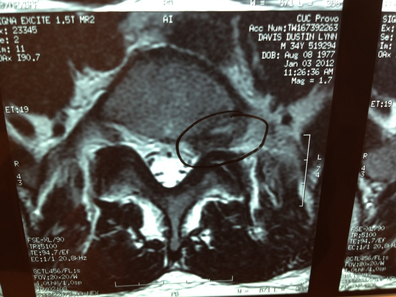
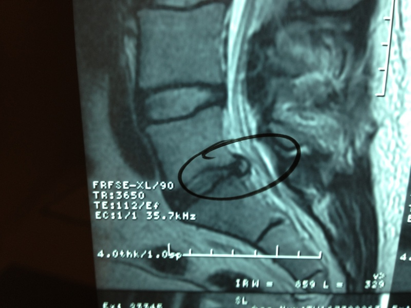
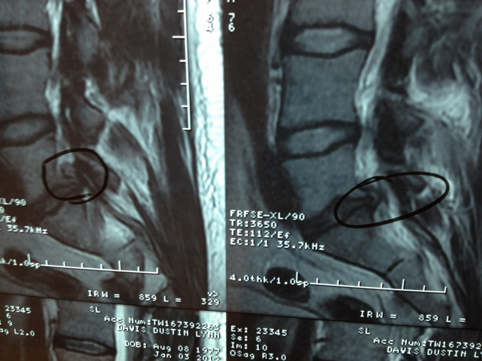

I thought I'd share the story of how I herniated a disc in my back to hopefully
education some programmers out there on why it is important to get up, stretch,
work out, drink water, and all that healthy jazz you hear people talk about.
[Getting in the zone](/blog/how-sports-improves-programmer-focus) is great, but
as you get older, it's not a good idea to get in the zone for more than an hour
at a time.

I'll admit, the older I get, the less active I get. In high school I played
sports non-stop, moving from football, to basketball to baseball with the
passing seasons. My motto in life was "I don't believe in exercise unless it is
in the form of a sport."

That hasn't worked out for me so well the older I have gotten. I always figured
I would go on to play college sports, but I broke my arm pitching in the state
tournament my senior year, then recovered and served a two-year mission and put
on about 40 lbs. while there. When I got home, my priorities changed and I was
more concerned about earning money than playing sports.

Since then I like to get in on all kinds of pick-up games such as basketball,
ultimate frisbee, volleyball, softball and even some racquetball on occasion.
That was about the extent of my exercise - basically, whenever I could find a
sport to play.

On New Year's Eve, our church ward/neighborhood has a tradition of playing
basketball. My lower back had been sore for a couple of days, but I generally
tolerate pain pretty well and thought I could play anyway. I figured I could use
the exercise since it had been a few months since I had played ultimate frisbee
due to cold weather. To be honest, it hurt worse that I admitted to anyone. I
could barely put on my shoes without wincing in pain.

**This should have been a major red flag! I wish I would have taken the time to
learn WHY my back was so sore. But, hindsight is 20/20.**

So I started playing with a sore back. I didn't play too hard because of it. But
after a couple of short games, my left leg was hurting clear down to my foot and
it was starting to go numb. Still, I didn't do much about it. We had plans for
the day. We went to lunch at Chili's and by that time I couldn't sit without
being in major pain. I kept having to stand up and walk around. I'm sure I
looked odd standing while my family was sitting and eating.

We then did some shopping when I finally admitted to my wife that I couldn't
take the pain any longer and I need to go home & lie down.

I pretty much stayed on my back lying on the floor the remainder of the day and
that night. I took 800 mg of Ibuprofen, but I didn't notice any difference. I
probably would have gone to the doctor that day, but I the next day my health
insurance was going to change and I didn't want to deal with the confusion. By
4:00 AM the next morning, I woke up Rachel and asked her to take me to the ER. I
didn't know if I could even stand or walk to ge to the car. I didn't know how I
would survive the drive to the ER.

The pain was excruciating. My legs were shaking uncontrollably and my teeth were
chattering from the pain. Fortunately, once I got in the car, I found a position
that was comfortable enough for the ride.

At the ER, they gave me a shot of painkiller and a prescription for some
stronger pain killers. Then they gave a prescription to have an MRI done.

My first attempt at an MRI was a miserable failure. My pain pills had worn off
completely and I wasn't given Valium or anything. I lasted about 3 or 4 minutes
in the MRI machine before I was screaming in pain for them to get me out. They
said there was nothing they could do for me so they just sent me on my way. By
this time I was very frustrated - mainly with myself for not being able to take
the pain and being so stupid to play basketball with a sore back.

A couple of days later I had another MRI scheduled at a different facility. They
gave me Valium to help calm me down. Again I didn't last more that a few minutes
in the MRI. I took a break and took the prescribed painkillers and waited for
them to kick in to try again. They also tried putting my on my side, which was
awkward for the MRI machine. That didn't help either. Same result. Then they
gave me an epidural with some pain killer and cortisone. Again I waited a bit
for it to kick in and went in for my 4th MRI attempt. I don't know how long I
made it - probably 5 to 7 minutes. When they pulled me out they said it would
just have to be good enough.

Once the cortisone kicked in, it helped out a great deal. But, I was told that
it would likely be temporary relief, then I may be back in the same pain. So the
next day I set up an appointment with my primary care physician to have him look
at the MRI results and make plans going forward. I couldn't get into my doctor
as soon as I wanted so I scheduled an appointment with a different doctor in
that office that I guess had just barely joined that practice.

It turns out that my new doctor had a herniated disc. I came in and never sat.
He preferred to stand. He tole me about his experiences and how he had opted out
of surgery. He had to manage his condition, but he was able to run and hand been
on a mile run up the canyon that morning. I think after that appointment was the
first time I started seeing hope. I asked for a referral to a Neural Surgeon
just in case though so I could get a relationship established just in case I did
decide to have surgery.

In the meantime I started doing a lot of research on the internet on things I
could do to improve my condition. I bought an eBook that was VERY helpful in
helping me understand what had happened, why, and what I could do to improve and
live with it, without surgery. It was almost like reading a slideshow with a
helpful picture on every page. It took me about an hour to read the whole thing
and I understood what was going on.

At my appointment with the neurosurgeon, I was prescribed physical therapy, told
to try to walk 3 miles per day and if things didn't improve I would likely need
a discectomy. He explained that my disc blew out so bad that I
had cartilage from the disk sitting on my nerve, which explained the constant
numbness in my foot.

I snapped some photos with my iPhone of the MRI results showing the herniation:

So I've been doing physical therapy three times per week and walking about 1.5
miles per day. I think things are improving and I'm hopeful that they will
continue to improve and I can gett the feeling back in my foot.

So again, to recap... If you sit at a desk all day, get up and stretch at least
once an hour. Drink lots of water (this will help you get up and stretch as you
are constantly running to the bathroom). If you're having lower back pain,
**DON'T PLAY BASKETBALL!** Instead, do stretches by laying on your stomach and
pressing your upper body up to arch your back more and use ice for relief. Sit
up straight in your chair. Raise your monitor, work on good posture.

Also, I've ordered a GeekDesk for home and my work also bought one for me so I
can sit or stand as I please. It's hard to stand and work ALL day.
