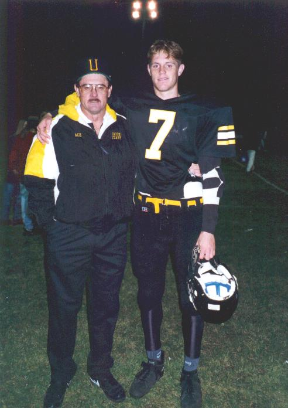
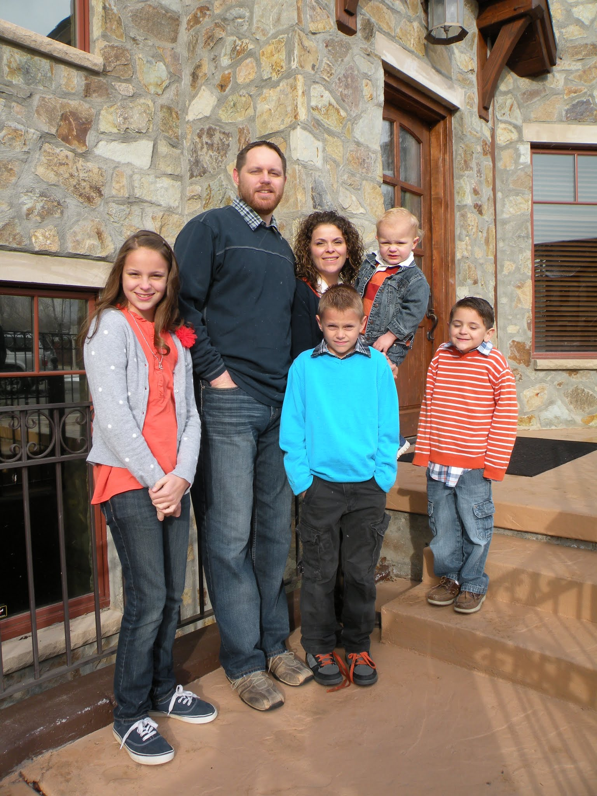

 _After my final football game
my senior year (1995) with my dad the offensive coordinator._

During my holiday vacation while going through my social feed I happened across
a post by [Alex Lawrence](https://twitter.com/_AlexLawrence) entitled
[_Don't Wait Until January_](http://startupflavor.com/dont-wait-until-january/).
I read it because it looked interesting, not because I had any desire to start
exercising or lose weight. Something in the article moved me though. It moved me
into activity. Alex's story resonated with me. I too used to play a lot of
sports. I too [had back problems](/blog/herniated-l5-s1-disc). Thankfully,
despite doctors saying it would most likely require surgery, I didn't need
surgery.

You wouldn't know it now if you met me, but I was voted by my senior class as
most athletic. I started varsity 7 seasons in 3 sports. Like Alex said, it's not
cool for me to be out of shape.

I love food. My parents had a hard time keeping our pantry stocked. We never had
left overs after a meal because I would just eat what was left as I cleared up
the table. I never had to worry about weight. I was a bean pole. In high school
I was 6'3" and 170 lbs. I tried to gain weight but it seemed I never could. I
was generally exercising at least 2 hours per day through sports.

 _Last day of my mission at
the Johannesburg temple - a stop on the way home._

My senior year I broke my arm pitching in the state tournament. I was bed ridden
for a while and once my arm healed I left to serve a two year mission where I
didn't exercise except for once a  week when we would often play sports, and I
was in a car the whole time after my first 5 months. I came home weighing 220
lbs. Most people told me I look normal so it felt like a comfortable weight. I
maintained that weight eating all I wanted and playing a lot of basketball,
volleyball, and softball. That was the what I weighed when I got married.

On my mission I met a couple that agreed to never gain more than 20% of their
marriage weight. I thought that was a cool idea so I told myself and my wife I
would never weight more than 242. I've stuck with that commitment. Once I get up
in the 240's (which I have a number of times), then I cut back, eat less,
exercise a little and get down to the 230 range. I don't think I have been down
to 220 since being married though.

_The most recent photo I could find - with the family_

After reading Alex's article I decided to jump in and make a public commitment.
I left a comment on his blog and even suggested we change the twitter hash tag
to [#TmFit](https://twitter.com/search/%23tmfit) rather that #FitLife because
there was less noise so it was easier to follow. Alex concurred. My goal is to
weigh 220 by March 1st, 2013. In the distant past I used to make goals public.
Then I read that [keeping goals private](http://sivers.org/zipit) can actually
be more beneficial. So I was hesitant to make a public commitment, but I decided
to do it anyway.

So far it's been great. I started using the gym membership that I was planning
on canceling. Alex was serious about encouraging each other. I have pushed my
workouts a bit farther than planned because of twitter feedback and
encouragement. I will admit, I HATE exercising for the sake of exercising. My
life motto was "I don't believe in exercise unless it is in the form of a
sport." Well, with four kids, a full-time job, and the life of an entrepreneur,
I don't really have time to play all the sports I would like to. So, I have got
to learn to like exercising - or at least learn to endure it.

During the holidays it was easier for me to take time to exercise. Now the real
challenge starts as I try to find a workable routine to get my daily exercise
in. [Come join us](http://startupflavor.com/dont-wait-until-january/) on #TmFit
and let's help each other reach our goals!
