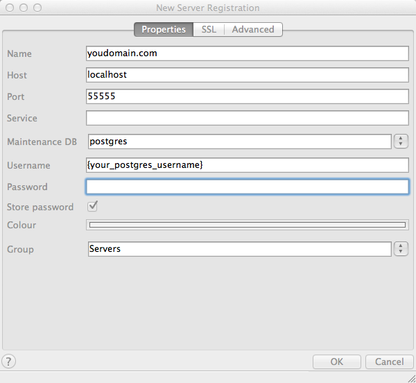

I'm not afraid to admit, I'm a visual guy. I like GUI interfaces.
[Sequel Pro](http://www.sequelpro.com/) makes it very easy to SSH tunnel into a
server and connect to MySQL, but there is nothing I have found built into
[pgAdmin3](http://www.pgadmin.org/) to use SSH tunneling for connections.

Luckily I
[found](http://www.ur-ban.com/blog/2010/10/25/ssh-tunnels-with-postgres-pgadmin/)
it is simple enough to do.

First, open an ssh tunnel:

```bash
ssh -fNg -L 5555:localhost:5432 $YOUR_USERNAME@$YOUR_DOMAIN
```

This opens an SSH connection in the background mapping your local port 5555 to
your server's port 5432 (Postgres' default port). Type "man ssh" to see what
each of these flags is specifically doing.

Now, create a new connection in pgAdmin using localhost as your host and
port 5555.


