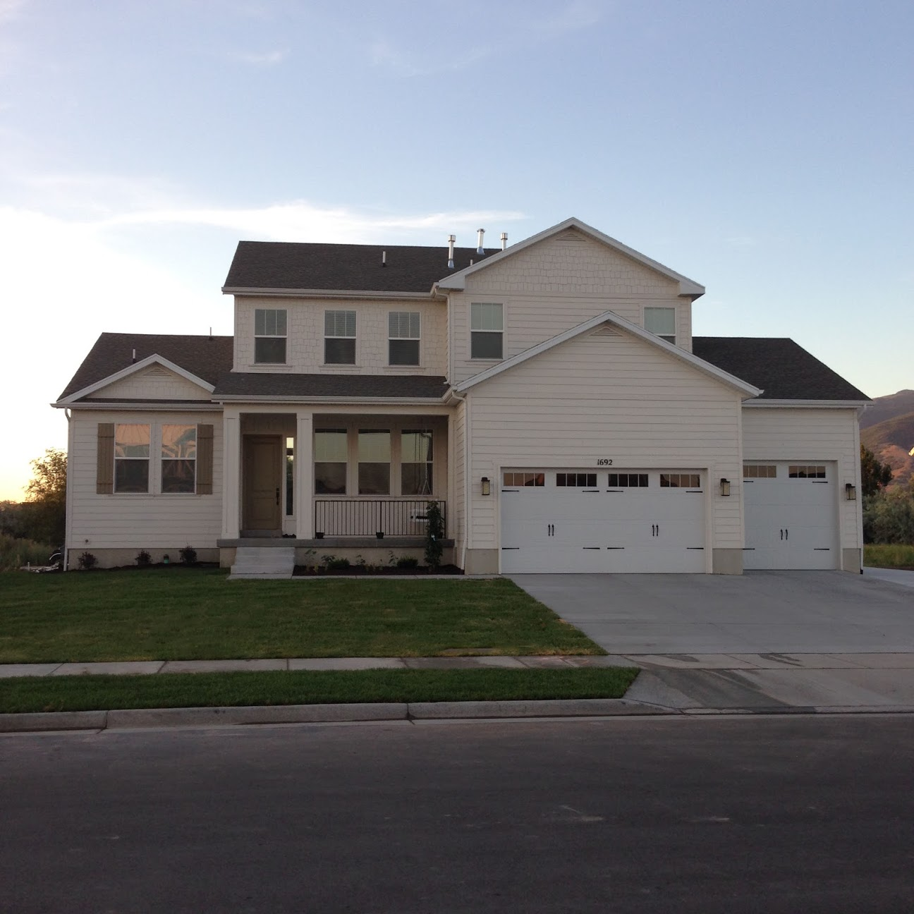
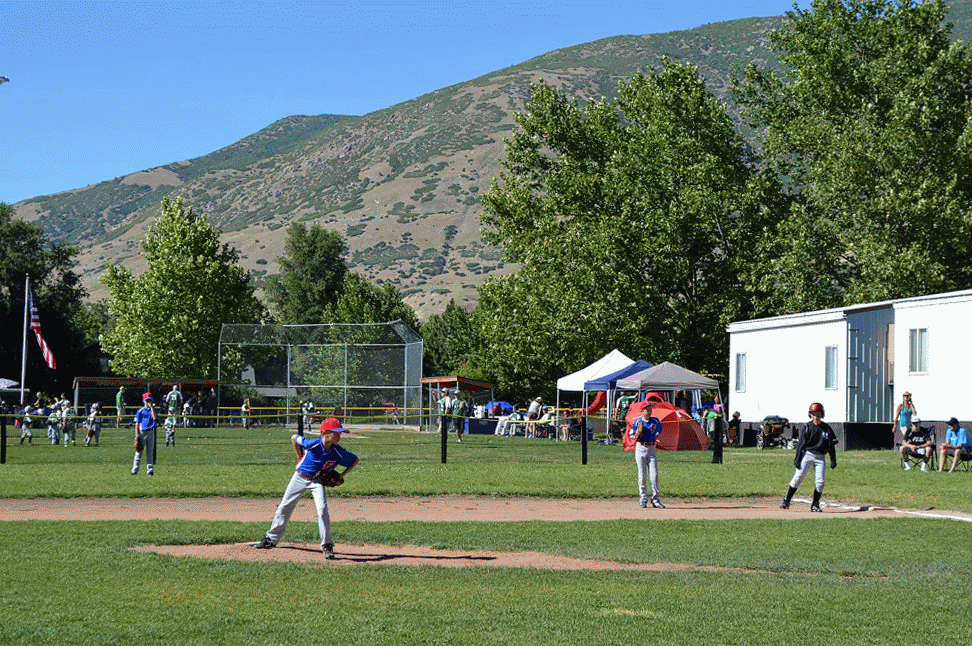
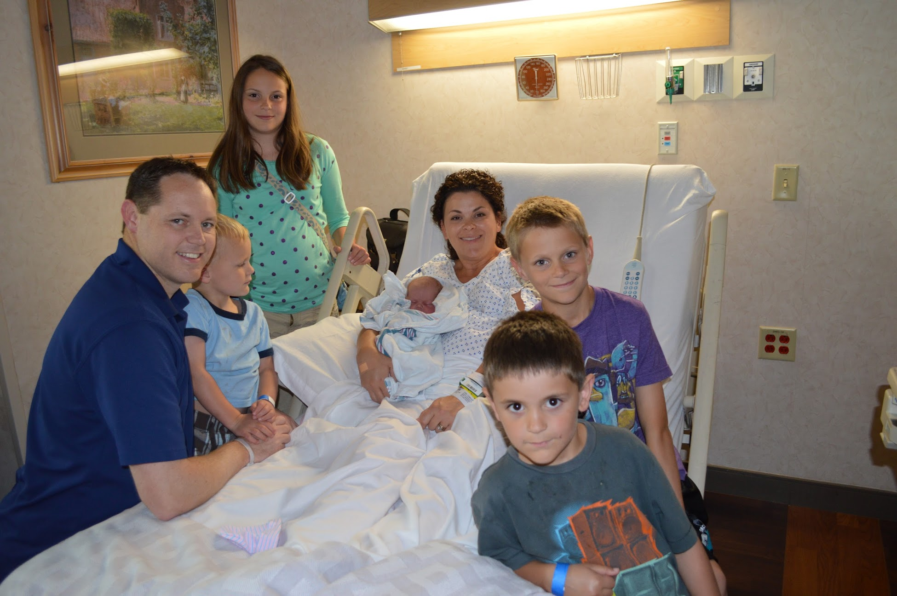
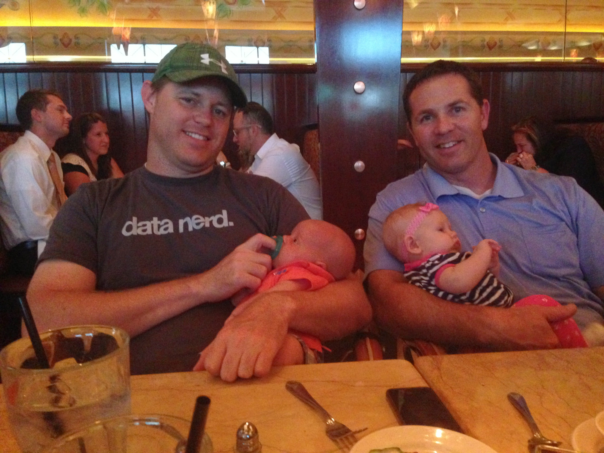
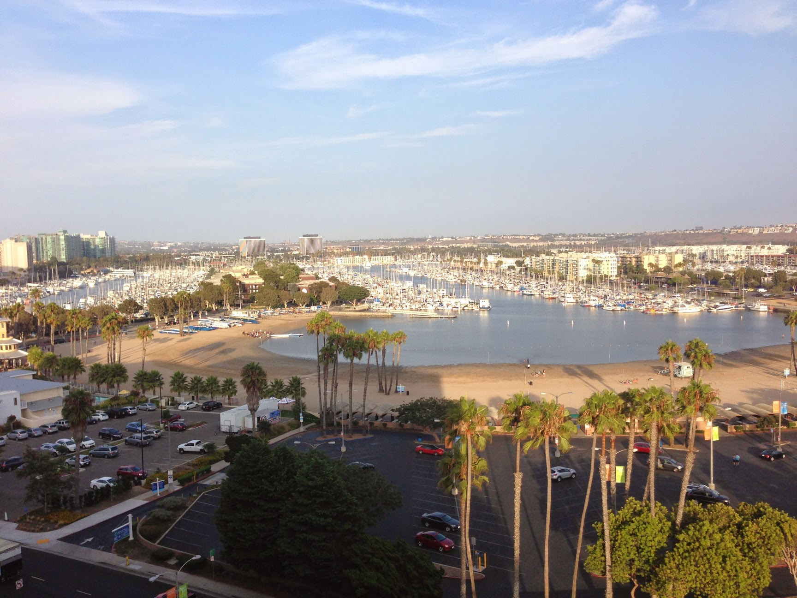
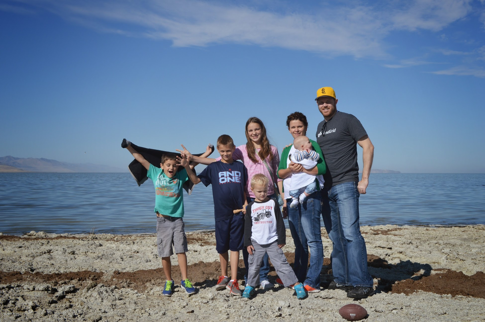
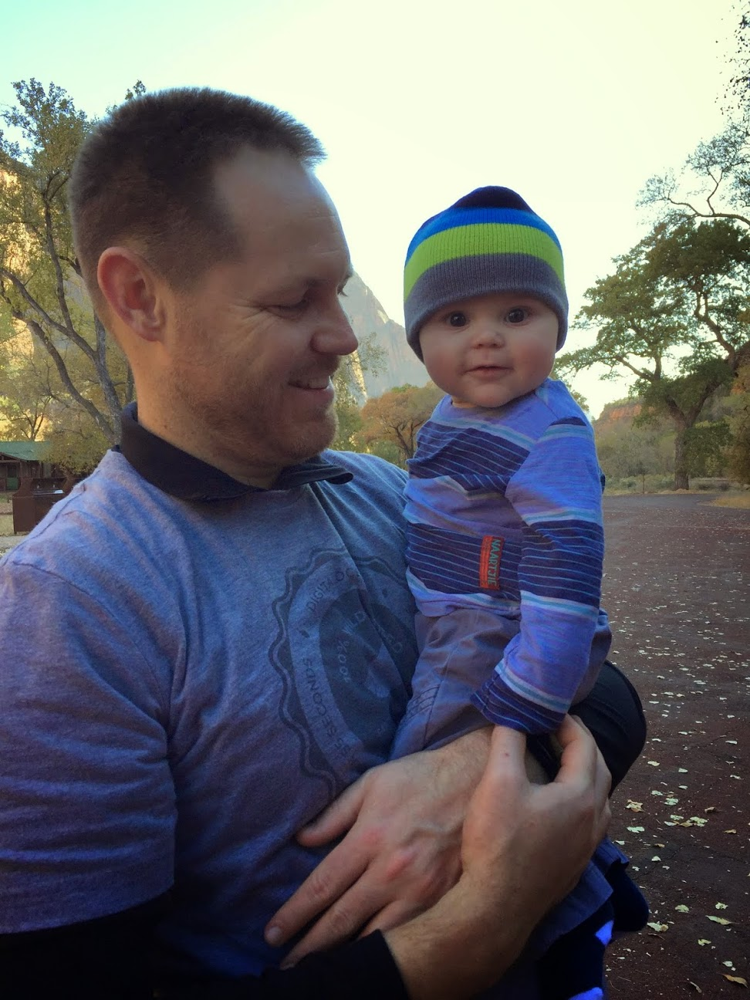
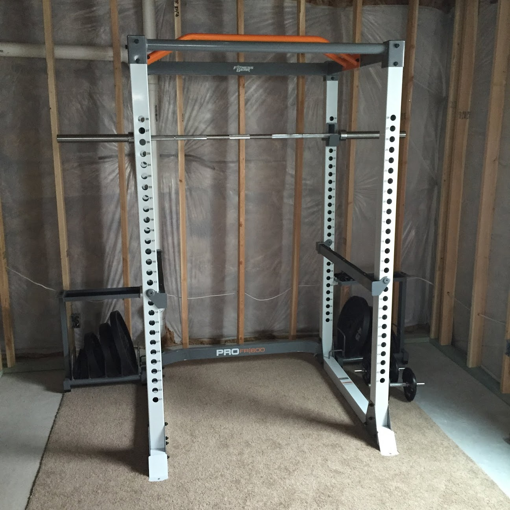

I've read a few year-end review posts recently and I find them fascinating. I
wish I had my own archives of year-end reviews to look back on. So I thought I'd
jump on the bandwagon and get started this year.

# What Went Well

## Gym & Fitness

I got my first gym membership in December 2013 and started going regularly. I
also started running (very slowly) for the first time in my life. These habits
continued into the start of 2014. I even ran my first ever 5k. For me, this is a
big deal because I really hate running. So to run 5k without stopping was a
pretty big accomplishment. Sure, I took last place out of all my co-workers I
ran with, but I finished middle of pack overall. Most importantly I finished!

## ng-conf

When [ng-conf](http://www.ng-conf.org/) was first announced, it sounded like it
was going to be a small conference here in Salt Lake City. So I was surprised
when I missed out on the early bird tickets both times. But I was fortunate to
get tickets in the final round. It seemed they were golden tickets though as
demand was huge.

It was a great conference and I was lucky enough to score early bird tickets
first round for 2015!

## New Home

We built a new home in Farmington, UT. We moved in on March 14th. We decided to
build so that we could get everything we wanted and not spend so much time on
remodeling projects. It is a great home and we love it. There are so many kids
in this new neighborhood. Our kids have made lots of new friends.

## Little League

When we moved to Farmington I signed the boys up for little league baseball. I
got an email saying they were in need of about 30 parents to volunteer as
coaches. I found that I really didn't enjoy coaching in Alpine so I stopped
volunteering. But since they were in great need I said I could coach any of my
sons they wanted me to. They asked that I coach in the Mustang league (9-10 year
olds).

It turns out that I had a blast. I had some great kids on my team. I got pretty
competitive as a coach because for the first time I found that my decisions
could often make the difference between winning and losing. In previous leagues
they didn't keep score and there technically were no losers nor winners. We
ended up taking 3rd in the final tournament which was pretty good as we had
about 12 teams in the league.

My 9 year old son really wanted to play on the all-star team but I just didn't
feel he was at that level. The league had about 6 kids that didn't make the the
A or B team that really wanted to play. So we put together a C team and I
coached it. We got killed every game, but it was a good experience for my son to
learn and get more pitching experience. He was also pretty happy to get an
all-star uniform.

Gehrig pitching in an all-star game

## Baby Griffey

Our 5th child was born on June 4th. He is our 4th son. We carried on the
tradition of naming him after a baseball player. I'll admit it has been quite an
adjustment. We had to upgrade our SUV, adjust our sleeping schedules, and
purchase all the baby stuff we had since given away. Plus, I am finding it is
very hard to find hotel accommodations for a family of 7. My wife and I both
feel confident now that our family is complete.

## Family Fun

We bought season passes to Lagoon this year since we are so close. It has been
fun because we don't feel like we have to make a whole day of it. Sometimes I
would just take one child in the afternoon on a weekday and there were virtually
no lines to any rides.

We haven't told the kids yet, but we got passes again for 2015.

## New Job

After having the baby I worked from home for a week. One day after working I
walked out of my office and sat on the couch to watch a movie with the family. I
thought, "It would be nice to work from home again and not have to commute."

The next morning I noticed an email in my inbox from the local Utah Python user
group. A company was looking for Python developers that would work remotely. I
looked into it more and ultimately interviewed with them and accepted an offer.
So I am now an employee of Verizon Digital Media Services. I work on upLynk.com.
It has been fun and I have learned a lot about video streaming the past six
months.

## Brought on a Partner

I partnered with a friend to help me work on EnvelopeBudget.com. The design and
user interface has been mostly an afterthought on this project. I bought a
template and I have just been using the css classes available in the framework.
Now my friend is re-designing it from the ground up. Once the designs are
complete I will work on re-coding it according to the new designs - mostly
utilizing AngularJS and an Django REST Framework.

# What Did No Go Well

## Missed MicroConf

I bought tickets to attend MicroConf in Las Vegas. I was pretty excited about
this. Unfortunately my boss at the time put a freeze on all vacation time in
order to meet deadlines. (I didn't feel this was necessary, but that is another
story.)

Fortunately, the organizers were kind enough to resell my ticket and give me a
refund and they also gave me early access to the recorded talks.

## Fitness

At some point - probably around the process of moving to Farmington, I stopped
working out. I stopped going to the gym completely and ended up canceling my
membership to save money. I have been pretty sedentary since then. I really want
to get back into an exercise program. I found that I enjoyed free weights the
most. I still hate running - especially on a treadmill.

## Finances

At the start of 2014 we had zero debt and
$80,000 in the bank. With the purchase of the house and all the upgrades and new decor, etc etc... plus a new car we now have about $30,000
in debt. As a personal finance guy that is supposed to know better, this is
quite stressful.

While the change in jobs has helped, what hasn't helped is losing income from
[my DIRECTV vs. DISH site](http://direct-vs-dish.com). At its high point, about
3 years ago, it was bringing in $6,000 per month. Now it brings in about $300
per month if I'm lucky. It's been hard to lose that income and hard to know what
to do with that site. I can't pay for any type of advertising and I don't really
enjoy SEO work so it has been hard to promote.

## Sold My Truck, Bought a Lemon

In order to pay down some debts I decided to sell my truck about 2 months ago. I
bought it at the end of 2013 for
$15,000 after taxes & registration. It was a great truck. I was only able to sell it for $11,000.

Worse yet I bought a lemon of a car. I ended up purchasing a 2003 VW Passat. It
had a bra on it. I was stupid not to check under the bra because when I got home
I found it had been in an accident and had a different bumper on it that wasn't
put on very well. I really had no recourse. I find I am often too trusting and I
can get taken advantage of easily by liars.

I took it to Midas to get new brake pads and they told me I needed to brakes. I
spend
$700 but when they gave me my car back the brakes didn't work at all. They wanted another $700
to try to fix it. I took it to a different mechanic to fix it properly and spent
another
$700. That along with some other work that needed to be done I spent an additional $2200
on a car that is just not worth it.

I like having a truck for times I need a truck, but I hated driving it around on
the freeway all the time. At some point I would like to own a small car and a
truck. It won't make my goal list for 2015, but some day...

## Let Employee Go

Due to the loss of so much income and my own neglect of EnvelopeBudget - not
marketing it properly, I didn't have the income to continue paying my full-time
programmer and had to let her go. It was very hard becuase she was good and so
loyal. I did use my network to find her another job and she is actually getting
paid more now, so I can feel good about that. And speaking of loyal I have found
that she continues to answer support questions and fix issues on the site out of
kindness. Isn't she great!?

## Stress & Regrets

I felt I spent too much time in 2014 looking backwards wondering if I made the
right decisions. Should we have sold our house in Alpine for a smaller house &
lot in Farmington in the middle of a swamp when the payments are the same? This
went through my mind far more than I care to admit.

Should I have sold my truck? In hindsight, probably not.

I never really looked back on my career move though. What I learned after
leaving was that I was much more stressed out at my old job than I thought. It
wasn't so much the job and the work I did, but more of the people I worked with.
I felt my manager didn't like me and didn't value my opinion and there was
NOTHING I could do to change that. It was just time to move on.

I found that moving jobs improved my back. I haven't had any back pain to speak
of in the 6 months since working from home full time. I think this is due to the
lower stress environment. I'm not constantly worrying about pleasing my manager.
I work for a boss who is also a brilliant developer. He understands development
and doesn't place unrealistic demands on my time & life. Plus, not commuting is
just one less thing to not have to worry about.

## Minor Health Issues

Around June I found myself very fatigued - hardly able to function. At my 6
month oncologist appointment I learned my blood count was way down and I was
anemic. It explained a lot and it is why I had such a hard time continuing to
exercise. My CT scans looked fine though. My doctor was stumped as to where I
was losing blood. After a few weeks I started to gain more energy and follow-up
visits showed my blood count improving. I'm still not sure what caused it. But
at my oncologist appointment this month my all my blood levels were back to
normal. I think I would just chalk it up to a virus or stress.

# Books I Read

1. [**Jouney to the Veil**](http://amzn.to/1A93SA5) - A collection of blog posts
   from LDS author, John Pontius, up until his death.
2. [**Triumph of Zion** by John Pontius](http://amzn.to/1A9402s)
3. [**Visons of Glory** by John Pontius](http://amzn.to/1wzaKC6) - This book was
   fascinating. We listed to it on our trip to Boise & back.
4. **Book of Mormon** - We read this as a family. Our stake president challenged
   us to read it in 6 months. We accepted and accomplished the challenge.
5. [**Coaching Youth Baseball the Ripken Way** by Cal Ripken Jr.](http://amzn.to/1xwoph2) -
   I bought this book for ideas to make my little league practices more fun and
   productive.
6. [**The Happiness Advantage** by Shawn Achor](http://amzn.to/1zuqbxj) - I
   purchased this after listening to his TED talk.
7. [**Fitness Confidential** by Vinnie Tortorich](http://amzn.to/1y4Epd2) - I
   purchased this book after listening to a
   [Pat Flynn podcast](http://www.smartpassiveincome.com/personal-trainer-successful-self-published-author-podcaster/)
   were Vinnie was a guest.
8. [**Rush Revere and the Brave Pilgrim** by Rush Limbaugh](http://amzn.to/1ry53IK) -
   This is an entertaining history book we listened to on our road trip to St.
   George.

# Places I Visited

We didn't travel much in 2015. This was mainly due to finances and having a
baby. We did take a couple of road trips though.

1. **Boise, ID** - I had a niece born a month before our baby. We make the trip
   up to be at her blessing and spend time with my brother and his family. They
   were kind enough to let us stay at their home, but I think they couldn't wait
   to kick us out afterwards!  At
   Cheesecake Factory in Boise with my big Bro.
2. **Eden, UT** - My mom rented a large condo for a family reunion. We hung out
   with family, played golf and did a lot of swimming.
    Family Photo in Eden, UT
3. **Marina del Rey, CA** - A couple of weeks after starting my new job with
   Verizon, they flew us to California for a one day company technology
   conference. It was a great overview of the company I was joining. I had an
   awesome hotel room on the top floor overlooking the marina. While I was in
   town the Braves (my favorite team) just happened to be in town to play the
   Dodgers so I invited a co-worker and got tickets to the game.
    Marina del Rey
4. **Antelope Island, UT** - This wasn't much of a road trip since it is so
   close to home. We packed a lunch and drove out to Antelope Island because it
   is somewhere I have always wanted to see.
    Antelope Island
5. **St. George, UT** - We rented a condo via [VRBO](http://vrbo.com) and stayed
   for 3 days in St. George. While we were there we spend one day visiting Zion
   National Park for the first time. The next day we went hiking in Snow Canyon
   with some friends who live down there. The cover image for this post is from
   that hike. That night we also went to a local play of The Odd Couple with
   them.  Hiking in Zion NP

# What's In Store for 2015?

## Freelancing

I've made the decision to take on a bit of freelancing work. I haven't done any
freelance work in a number of years. Why get paid
$45 an hour when I can do nothing and make $6,000 a month from one of my
websites? But, like I said, that income has dried up.

Sometimes it is worth trading hours for dollars - when you really need the
dollars. I have some financial goals for 2015 that will require some extra
income so right now, the quickest way for me to get that income is to take on
some freelance projects.

I have already started. I have agreed to tutor someone in San Francisco to help
them learn Django. We have had one session so far. I had a short skype call
today from another person that is looking for someone to tutor him to help him
build and host a Django site. So I guess this is more like consulting than
freelance. I'm charging `$50` an hour right now. If this continues I can see
raising my rate as my time is limited, but I'm just getting my feet wet with
tutoring/consulting.

## EnvelopeBudget 3.0

As I mentioned I brought on a friend and brilliant UX designer to help me. My
goal is to have the 3.0 beta version available to customers by June 1, 2015.

## 15 Year Anniversary

This year will be my 15 year anniversary. I really want to do something fun with
my wife. I would love to take her to Hawaii as neither of us have ever been. We
have also never been on a cruise, so I would love that too. Depending on what
the budget allows, it may just be a trip to San Diego. Where ever we go, I want
it to include a beach so we can relax. Now I just need to find someone to watch
our 5 kids as we get away!

## Goals

Last night we set individual goals as a family. We wrote them out twice and
sealed one of them in and envelope to open next year to see how we did. I wrote
10 goals. I'll share my goals here:

1. **Complete at least 150 workouts throughout the year.** I recently purchased
   some olympic weights and a power rack so I can do this at home. I plan on
   following the [5x5 Strong Lifts](http://stronglifts.com) routine.
2. **Go to the temple at least 25 times.** I'm LDS and one of the best places I
   can go to feel at peace is the temple. I like to go first thing in the
   morning to start my day.
3. **Read or Listen to 13 books.**
4. **Write 150 journal entries.**
5. **Write 50 blog posts.** These can be on any of my blogs, but mostly likely
   on this blog or on EnvelopeBudget.com.
6. **Go Home Teaching at least 10 times.** Another church related goal. I should
   go every month, but 10/12 would still be a major improvement for me this
   year.
7. **Take Rachel on a 15-year anniversary vacation - out of state - beach
   included.**
8. **Pay off credit card debt.**
9. **Launch new version of EnvelopeBudget.com.**
10. **Landscape our backyard.** We ran out of money to complete our back yard
    last summer. I want to get it done this summer so our kids can play back
    there.  My new home power rack!
