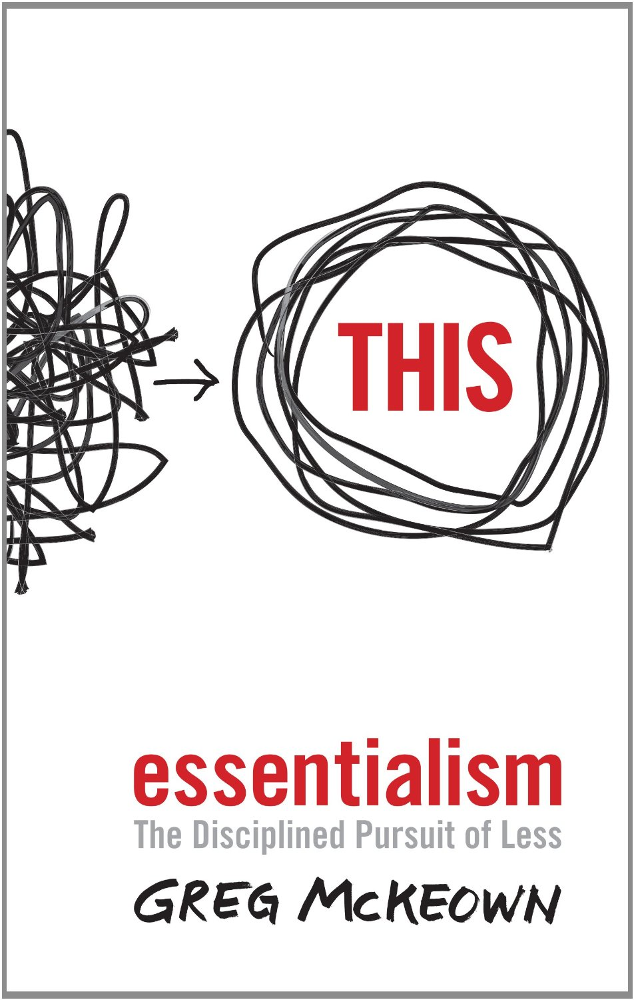

I completed the audio book
[_Essentialism: The Disciplined Pursuit of Less_ by Greg McKeown](http://amzn.to/150TWhb).
I had read some good reviews on how it has changed some people lives such as
[Stu McLarin](http://stu.me/sell-my-business/),
[Michael Hyatt](http://michaelhyatt.com/essentialism.html) and
[Pat Flynn](http://www.smartpassiveincome.com/5-books-from-2014/).

I don't know that is was as life changing for me as it was for them. Yes the
book resonated with me and there were some good ideas in there, but nothing
seemed revolutionary. In fact, it almost felt like stuff I had been taught my
whole life, but backed up and supported by research and stories and given a new
term: "essentialism".

I guess I feel like I have a good balance in life as it is. I think I
unconsciously made many essentialism type decisions after I was
[diagnosed with GIST cancer](http://www.davisvillage.com/my-cancer.html). In
fact, I made a major job change last summer in order to take leave the
face-paced world of a startup where I was in-line to be the CTO in order to take
on a less stressful job where I could work from home and spend less time
commuting and more time with my family.

I don't feel like I have a major problem of taking on too much or doing
non-essential tasks. In fact, I often feel like there is more I **should** be
doing. So, yes, there are many ways I can improve, but none of them are major
life altering decisions. I just need to focus on the essential things I need to
do in order to reach my goals. **Setting goals regularly is one of those things
I should be doing more of.**

One interesting aspect of the book that made me do a "Wait, what?" was when the
author said he likes to read classic literature first thing in the morning. He
mentioned a number of books he liked to read and two of them he included were
the Bible and the [Book of Mormon](http://www.mormon.org/free-book-of-mormon). I
didn't realize the author was LDS. I have to admit, that once I realized that, I
did pay a little more attention as I am also a Mormon. I guess I have a little
bias in me.

One question I have is **can wealth really be achieved by practicing
essentialism?** It seemed to me that many of the stories in the book where of
wealthy people turning to essentialism in order to cope with the ever increasing
demands upon their time.

**Is there a season of hustle to get to the top, then a turn to essentialism to
stay there without burning out?** Or, can you practice essentialism from the
beginning and attain a level of financial success much faster? I think people
often realize that once they have more than enough money, money does not buy
happiness. Once money is no longer a motivation they turn to essentialism to
find happiness.

I don't know if that question was completely answered for me. I'd be curious to
hear more thoughts on this.

I would like to read or listen to this book again in about a year to see if it
has had much effect on me and to re-evaluate where I am.
