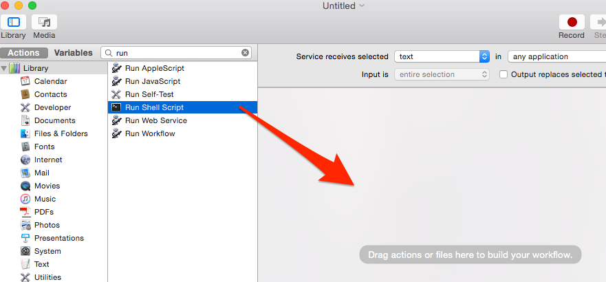
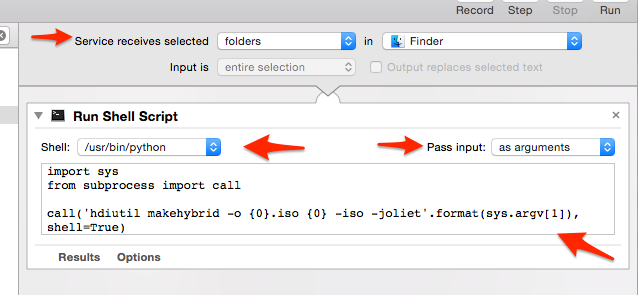
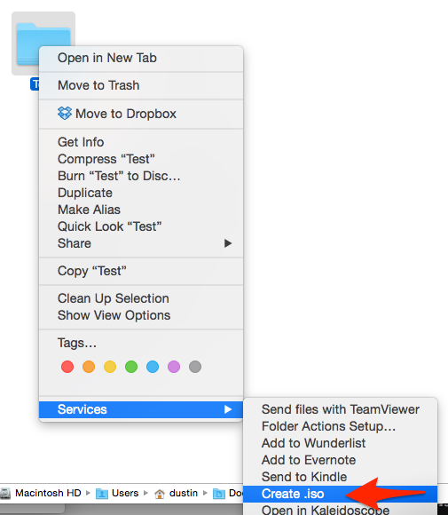

Thanks to
[Matt Berther](https://matt.berther.io/2008/12/14/creating-iso-images-from-a-folder-in-osx/)
for this nice little command to create an iso image from a directory in OS X.

```bash
hdiutil makehybrid -o ~/image.iso ~/path/to/folder -iso -joliet
```

Let's be honest, I'm not going to remember this command in 6 months when I need
to run it again. So I created a service. I'll show you how simple it was.

### Open Automator & create a new service


### Add the action to Run Shell Script



### The service receives selected **folders** in **Finder**. Set the shell to **/usr/bin/python** and pass input **as arguments**. Add the following 3 lines of python:

```python
import sys from subprocess import call

call('hdiutil makehybrid -o "{0}.iso" "{0}" -iso -joliet'.format(sys.argv[1]),
shell=True)
```



### Save the service and give it a name such as "Create .iso"

Now you can right-click on a directory to create an iso image.

