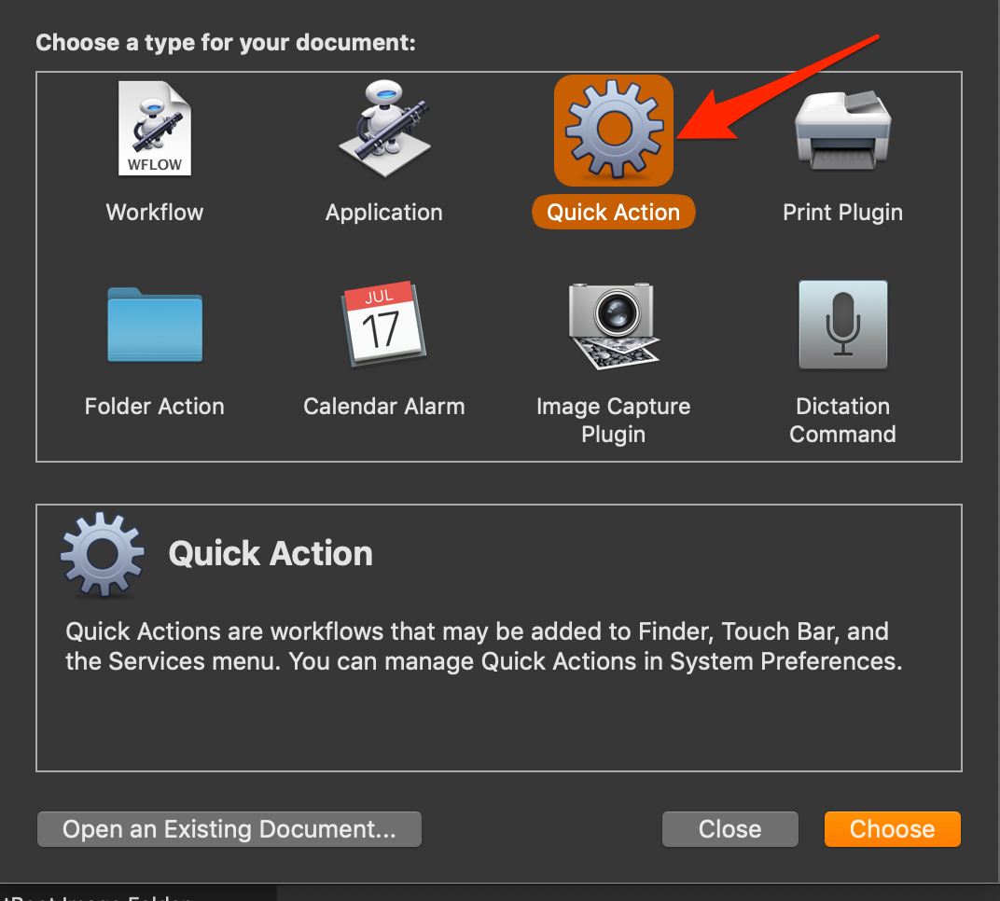
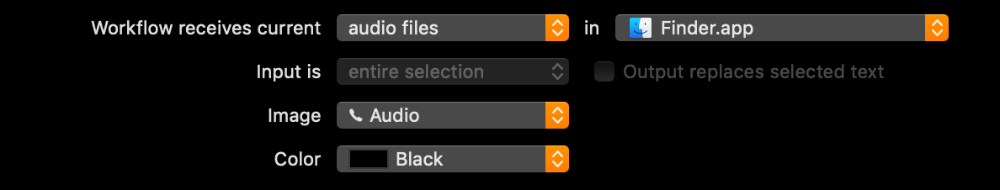
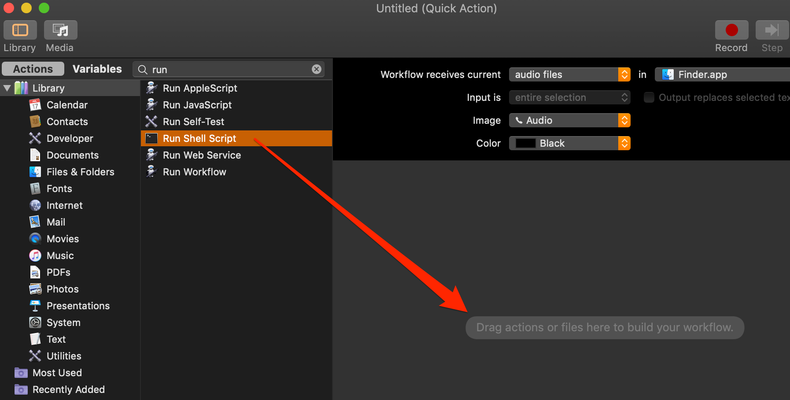
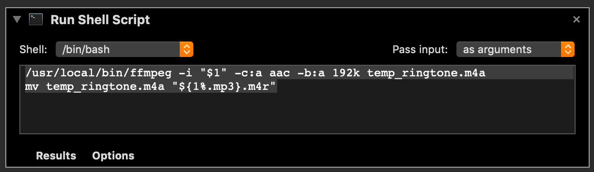
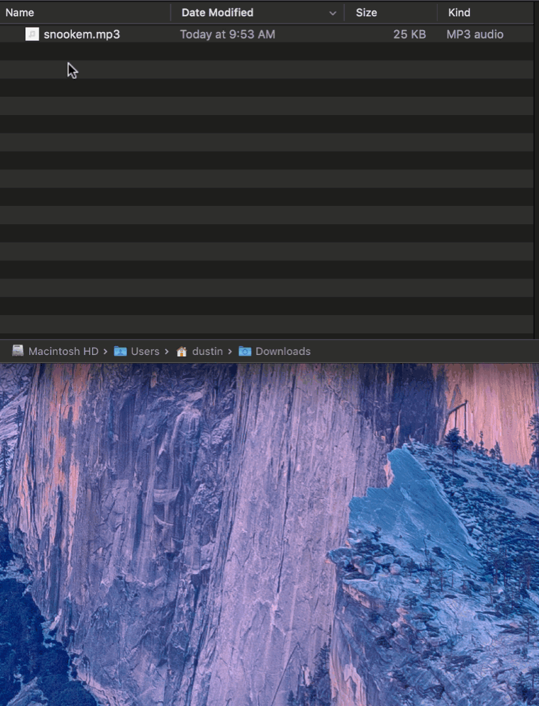

Creating your own ringtones for your iPhone is a fairly simple process:

1. Find your audio source
2. Create a clip of that audio (I prefer
   [Audacity](https://www.audacityteam.org/))
3. Convert that audio to and AAC m4a file
4. Rename the file with an m4r extension
5. Use iTunes to add the m4r file to your iPhone

This tutorial will only cover steps 3 and 4 to make it easier for you.

It will require having [FFmpeg](https://ffmpeg.org/) installed on your machine.
You can easily install it with Homebrew:

    > brew install ffmpeg

You can now use FFmpeg to convert an mp3 file to m4a with the following command:

    > ffmpeg -i clip.mp3 -c:a aac -b:a 192k clip.m4a

Good luck remembering that though. You could add a nice function to your .zshrc
or .bashrc file:

    ringtone() {
        ffmpeg -i "$1" -c:a aac -b:a 192k temp_ringtone.m4a
        mv temp_ringtone.m4a "${1%.mp3}.m4r"
    }

Now you could simply run the following:

    > ringtone clip.mp3

This would generate a file name clip.m4r

But, let's go one step further. Let's add an Automator service that will allow
you to right-click on an audio file and give you an option to convert it to a
ringtone.

### Step 1: Open Automator

### Step 2: Select File > New and then select "Quick Action"

### Step 3: Set the following options:

Workflow receives current: **audio files**  
in: **Finder.app**  
Image: **Audio**

### Step 4: Drag the Run Shell Script action into your workflow

### Step 5: Set the Shell and Input parameters

Shell: either **/bin/bash** or **/bin/zsh**  
Pass input: **as arguments**

### Step 6: Add the following script:

    /usr/local/bin/ffmpeg -i "$1" -c:a aac -b:a 192k temp_ringtone.m4a
    mv temp_ringtone.m4a "${1%.mp3}.m4r"

### Step 7: Save the Automation

Press ⌘S to save. Name it something like "Create Ringtone"

### Step 8: Test it out!

[If you just want the workflow, you can download it here. Create-Ringtone.workflow](images/Create-Ringtone.workflow.zip)[Download](images/Create-Ringtone.workflow.zip)
