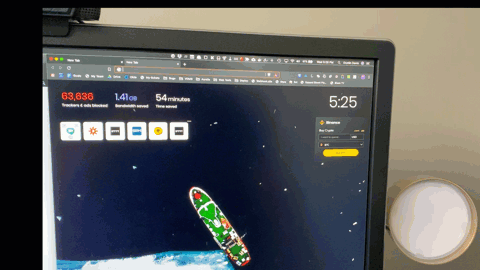
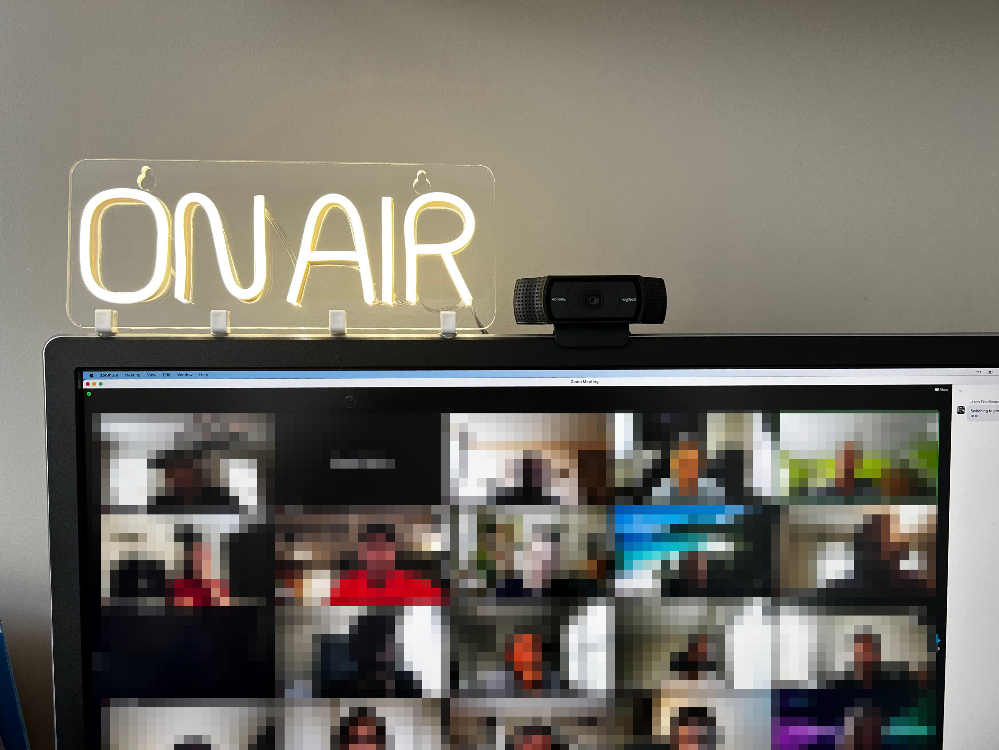

These days I tend to spend a lot of my time in Google Meet meetings. I recently created some automated tools to address a couple of problems.

### The Problems

1. I work from home. I have a family, and my office has glass doors. My family often wonders when it’s safe to talk to me or when I’m in a meeting. I need a reliable way to let them know when I’m in an online meeting.
2. My window lets in a lot of light, making my face too dark to see in webcam videos.

I tried a few solutions, such as using the door or a remote-controlled LED light, but I often forgot to control them manually. Then, I found a better solution using automation.

### The Solution

This is version 2. I originally used IFTTT to automate the light. But, they
changed their free tier so that you need a paid subscription to control
SmartLife devices. So, I switched to Home Assistant.

## Hardware

Hardware needed:

- [Smart Plug](https://amzn.to/31wUiMU)
- [Lamp](https://amzn.to/3TcVyzy) (I started with \$7 lamp from Walmart)

## Docker & Home Assistant Setup

So there is a better, free alternative: **Home Assistant**. Here’s how I set it up:

### Step 1: Docker Setup

You can use Docker to run Home Assistant. Here’s the `docker-compose.yml` file to get started:

```yaml
version: '3'
services:
  homeassistant:
    container_name: homeassistant
    image: homeassistant/home-assistant:stable
    volumes:
      - ./config:/config
      - /etc/localtime:/etc/localtime:ro
    environment:
      - TZ=America/Denver  # Replace with your timezone
    ports:
      - "8123:8123"  # Maps port 8123 on the host to the container
    restart: unless-stopped
```

Once the Docker container is running, access Home Assistant at `http://<your-local-ip>:8123`.

### Step 2: Connect Home Assistant to Tuya (SmartLife)

1. Go to **Configuration** -> **Devices & Services** -> **Add Integration**.
2. Search for **Tuya** and follow the prompts to link your SmartLife account.

### Step 3: Create Webhooks in Home Assistant

Now, create webhooks to control your desk switch (or any other device).

1. Go to **Settings** -> **Automations & Scenes** -> **Create Automation**.
2. Set a **Trigger** of type **Webhook**, and use the ID `desk_switch_on` to turn the switch on, and `desk_switch_off` to turn it off.
3. Set **Actions** to `switch.turn_on` or `switch.turn_off`, and use the entity ID of your switch (`switch.desk_socket_1`).

## Updated Bash Script

Here’s my updated `checkmeet` script that checks for open Google Meet or Microsoft Teams tabs and calls the appropriate webhook to toggle the light:

```bash
#!/bin/bash

# Path to store the last state
state_file="/tmp/desk_switch_state.txt"

# Initialize the state file if it doesn't exist
if [ ! -f "$state_file" ]; then
  echo "off" > "$state_file"
fi

# Function to check if the browser has a meet.google.com or a teams.microsoft.com tab open
check_tabs_for_meet_or_teams() {
  browser=$1
  osascript <<EOF
  tell application "$browser"
    set meetOrTeamsTabExists to false
    repeat with w in windows
      repeat with t in tabs of w
        if (URL of t contains "meet.google.com") or (URL of t contains "teams.microsoft.com") or (URL of t contains "/l/meetup-join/") then
          set meetOrTeamsTabExists to true
        end if
      end repeat
    end repeat
    return meetOrTeamsTabExists
  end tell
EOF
}

# Function to call Home Assistant webhook
call_webhook() {
  webhook_id=$1
  curl -X POST http://192.168.1.4:8123/api/webhook/$webhook_id
}

# Infinite loop to check every 5 seconds
while true; do
  # Check Arc and Chrome browsers
  arc_meet_or_teams_open=$(check_tabs_for_meet_or_teams "Arc")
  chrome_meet_or_teams_open=$(check_tabs_for_meet_or_teams "Google Chrome")

  # Determine current state
  if [[ "$arc_meet_or_teams_open" == "true" ]] || [[ "$chrome_meet_or_teams_open" == "true" ]]; then
    current_state="on"
  else
    current_state="off"
  fi

  # Read the last state
  last_state=$(cat "$state_file")

  # Only call the webhook if the state has changed
  if [ "$current_state" != "$last_state" ]; then
    if [ "$current_state" == "on" ]; then
      call_webhook "desk_switch_on"
    else
      call_webhook "desk_switch_off"
    fi
    # Update the last state
    echo "$current_state" > "$state_file"
  fi

  # Wait for 5 seconds before the next check
  sleep 5
done
```

## Keeping the Script Running

To make sure the script starts at login and keeps running, you can use **launchd** on macOS. Here’s how to set it up:

1. Create the following plist file in `~/Library/LaunchAgents/com.dustin.checkmeet.plist`:

```xml
<?xml version="1.0" encoding="UTF-8"?>
<!DOCTYPE plist PUBLIC "-//Apple//DTD PLIST 1.0//EN" "http://www.apple.com/DTDs/PropertyList-1.0.dtd">
<plist version="1.0">
  <dict>
    <key>Label</key>
    <string>com.dustin.checkmeet</string>
    <key>ProgramArguments</key>
    <array>
      <string>/path/to/your/checkmeet</string> <!-- Replace with the full path to your script -->
    </array>
    <key>RunAtLoad</key>
    <true/>
    <key>KeepAlive</key>
    <true/>
    <key>StandardOutPath</key>
    <string>/tmp/checkmeet.out</string>
    <key>StandardErrorPath</key>
    <string>/tmp/checkmeet.err</string>
  </dict>
</plist>
```

2. Load the service:

   ```bash
   launchctl load ~/Library/LaunchAgents/com.dustin.checkmeet.plist
   ```

Now, your "On Air" light will automatically turn on and off based on your Google Meet or Microsoft Teams meeting status, and the script will restart automatically if needed.

## That’s it

Now, when I open a Google Meet window or tab, within a few seconds my lamp turns
on. When I close the tab, the lamp turns off.



## Hardware Update

I found this ON AIR light on eBay for about 30 bucks. I hot-glued some clips to
the top of my monitor and mounted it for fun look.


