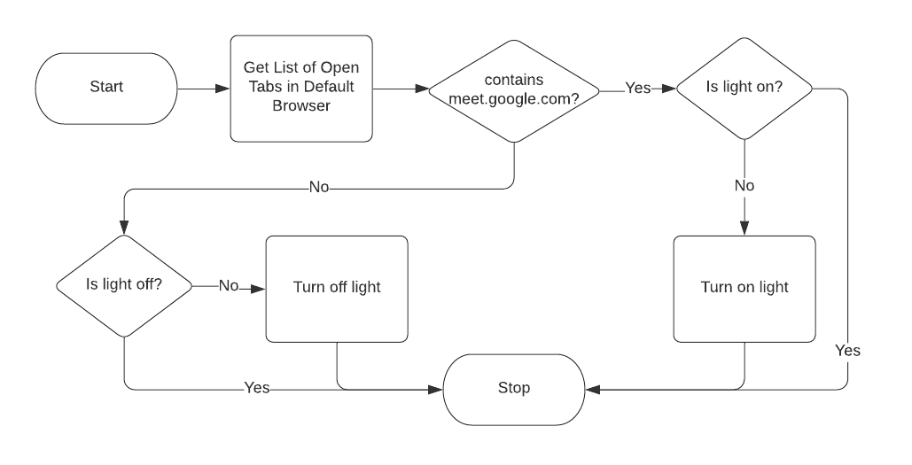

These days I tend to spend a lot of my time in Google Meet meetings. I recently
created some automated tools to address a couple of problems.

The problems:

1. I work from home (even before COVID-19). I have a wife and 5 kids. My office
   has glass doors. My family often wonders when it is safe to come to talk to
   me, or when I’m in a meeting. I need a reliable way to let them know when I’m
   in an online meeting.
2. I have a window in my office that lets in a lot of light. Due to the
   placement of my workstation, my face is often too dark to see in webcam
   videos.

I’ve tried a few options to solve both of these issues. With number 1, I’ve
tried using the door (open vs. shut) to indicate meetings. I’ve tried using a
remote-controlled LED light to indicate it. Both had problems. I forget to open
or close the door or turn the light on and off. Then there were the battery
problems with the lights. My kids kept playing with them, etc.

With number 2, I’ve tried some camera lights to help light up my face. But the
latest one I tried wasn’t bright enough, and the batteries would die within 30
minutes.

Now, for a better solution… I’ve been using this for only a day so far, but
already I’m liking it much better. It could use some refining, but right now, it
works.

Here is a high-level flowchart of how things work:



Hardware needed:

- [Smart Plug](https://amzn.to/31wUiMU)
- [Lamp](https://amzn.to/3b2VjzM) (I bought \$7 lamp at Walmart)

## Getting Tab URLs

I found this AppleScript online that will return all the URLs from all the tabs
that are open from various browser windows. I use Brave Browser, so I have
modified the script accordingly.

```applescript
# shows all urls open in Brave
set urlList to ""

if application "Brave Browser" is running then
  tell application "Brave Browser"
    set window_list to every window
    repeat with the_window in window_list
      set tab_list to every tab in the_window
      repeat with the_tab in tab_list
        set the_url to the URL of the_tab
        set urlList to urlList &amp; the_url &amp; "\n"
      end repeat
    end repeat
  end tell
end if
```

## Bash Script

I had a few iterations of this script. I started in Python, then moved to
node.js. Finally, I decided to just write something more simple in bash.

```bash
#!/bin/bash

# be sure to set global env var IFTTT_MAKER_KEY
export MEET_ON_AIR=new

function get_tabs () {
    local tabs=$(osascript tabs.osa)
    # echo $tabs
    local pattern="https:\/\/meet\.google\.com"
    if [[ $tabs =~ $pattern ]] ; then
        echo "found"
    else
        echo "nomeet"
    fi
}

function check_meet () {
    local found=$(get_tabs)
    local trigger=0

    if [[ $found == "found" ]] ; then
        if [[ $MEET_ON_AIR != "on" ]] ; then
            echo "Turning on the light"
            MEET_ON_AIR=on
            trigger=1
        fi
    else
        if [[ $MEET_ON_AIR != "off" ]] ; then
            echo "Triggering light out"
            MEET_ON_AIR=off
            trigger=1
        fi
    fi

    if [[ $trigger == 1 ]] ; then
        local url="https://maker.ifttt.com/trigger/meet-$MEET_ON_AIR/with/key/$IFTTT_MAKER_KEY"
        curl -X POST $url
    fi
}

while :;
    do
    check_meet
    sleep 5
done
```

## Keeping It Running

I created a launchd script. I started with this nice tool and eventually bought
a nifty little app called LauchControl that helped me better understand launchd.
Here is my plist.

```xml
<?xml version="1.0" encoding="UTF-8"?>
<!DOCTYPE plist PUBLIC "-//Apple//DTD PLIST 1.0//EN" "http://www.apple.com/DTDs/PropertyList-1.0.dtd">
<plist version="1.0">
<dict>
	<key>EnvironmentVariables</key>
	<dict>
		<key>IFTTT_MAKER_KEY</key>
		<string>[MAKER_KEY_HERE]</string>
	</dict>
	<key>KeepAlive</key>
	<dict/>
	<key>Label</key>
	<string>com.redseam.launchd.meet-on-air</string>
	<key>Program</key>
	<string>[FULL_PATH_TO]/meet-on-air.sh</string>
	<key>RunAtLoad</key>
	<true/>
	<key>WorkingDirectory</key>
	<string>[PATH_TO_DIR_WITH_APPLESCRIPT]</string>
</dict>
</plist>
```

## IFTTT Automation

Part of the reason I switched from Python to Node was that I was looking for a
way to control a Smart Life plug I had available. There was a node API wrapper
for it. As I started going down that rabbit hole I realized it would be much
easier to just use IFTTT.

I already had an IFTTT account with a maker webhook configured, so I just used
that. Basically, once you have an account, you can go to
https://ifttt.com/maker_webhooks/settings and it will show you the URL your
webhook key. You can then go to https://maker.ifttt.com/use/ to test it out. The
{event} key string that you use in the URL will be the one you use to trigger
off of in your IFTTT Applet.

## IFTTT Applets

The Applet is pretty straight forward. You will need to make sure you are
connected to the Smart Life service. Basically, there are two Applets. The first
one looks for the web request event name meet-on and turns on my outlet. The
second one looks for the event meet-off and turns off the outlet.

## That’s it!

Now, when I open a Google Meet window or tab, within a few seconds my lamp turns
on. When I close the tab, the lamp turns off.


