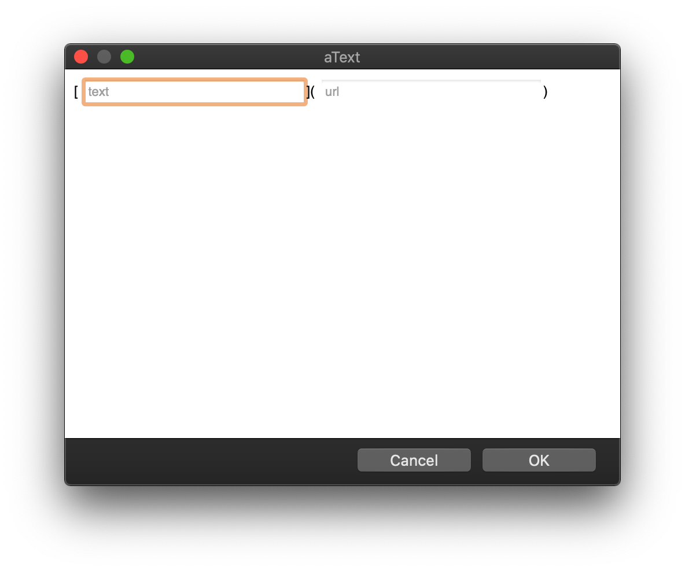

I don't blog as much as I once did. As I've thought about it, I feel much of the
reason for it is because I don't like using WordPress.

I've tried several tools. I have the WordPress app. I've tried different
plugins. But, nothing is really enjoyable to use.

Often, when I want to take notes on something. I will pull up my
[LightPaper](https://getlightpaper.com/) app and jot them down and use
[Markdown](https://www.markdownguide.org/).

I enjoy Markdown because it is simple to write and easy to use. I have a
collection of [aText](https://www.trankynam.com/atext/) shortcuts that I use
with Markdown as well. For example, if I want to create a link, will type
`md.link`. Immediately, aText will open a modal window to enter my link title
and URL like so:

Whenever I wrote a post in WordPress, it feels like I spend the next hour
tweaking it. I save and preview, save and preview, rinse and repeat. This is not
a fast process.

There are so many plugins and I feel like I spend more time upgrading plugins
than I do writing posts.

It feels like 80% of websites are powered by WordPress these days, so like the
Windows operating system, they are going to be the most targeted platform for
crackers.

## Gatsby

I'll be honest, I'm not a fan of [React](https://reactjs.org/). For me, it is
hard to read. I don't like JSX.

That said, I'm very impressed with [Gatsby](https://www.gatsbyjs.com/).
Honestly, the feature I like most is the progressive image rending. I first
noticed it on [Kent C. Dodds](https://kentcdodds.com)'s website and I was
jealous. So, I started to learn Gatsby.

It is not difficult to get up and running, but there were a few things about
Kent's blog that I loved and I was struggling to reproduce from scratch.😩

Then it occurred to me, his blog is
[open-source](https://github.com/kentcdodds/kentcdodds.com) so why not just use
his blog as a starting point?

I hope you don't mind Kent!🙏 They say imitation is the highest form of
flattery, right? 😬

I just changed some colors and took a bunch of components out and use this as a
starting point.

I love writing posts in Gatsby. I can use my favorite LightPaper or
[VSCode](https://code.visualstudio.com/). I have found a nice
[Grammaryly plugin for VSCode](https://marketplace.visualstudio.com/items?itemName=znck.grammarly)
as well, which will really help me out!

## Migrating WordPress Posts

I took some tips from
[Tania Rascia](https://www.gatsbyjs.com/blog/2019-03-21-migrating-from-wordpress-to-gatsby/)
on migrating WordPress posts to Gatsby. Basically, I used the same export method
and [ExitWP](https://github.com/thomasf/exitwp) script to convert all my
WordPress Posts to MarkDown.

I then wrote a Python script to clean them up more to give them some default
frontmatter, then loaded them all into a directory called `wordpress`.

I have some other scripts to move them out of that directory into my preferred
directory structure. I then clean them up more and add a relevant banner image.

I've got a lot of cleanup work to do since my blog is 15 years old. I will
likely just delete many old posts. But I'll be checking my WordPress stats to
see what people are still accessing and keep those posts around.

## Comments

I'm hesitant to add comments. It seems most of them were just spam on my
WordPress site and I spent a lot of time cleaning them up as well.

I noticed that [Jeremy Danyow](https://github.com/jdanyow) (whom I recognize as
an [Aurelia](https://aurelia.io) contributor) has created a nice open-source
project called Utterances to add GitHub comments. I may give that a shot at some
point.

Otherwise, I may just follow Kent's lead and use Twitter as my commenting
system. 🐦
