(For all our photos, visit: https://photos.app.goo.gl/kP99W9Raz6D42J4L8)

## Day 1 - Sunday

We had stake conference this weekend so I had very few meetings. It was also
Father's Day. We had a nice stake dinner and apple pie ala mode. We then left
Gehrig home and took the other boys to meet Leslie in Salt Lake so they could
spend the week with them. We then went to the airport and got there 2 hours
early.

Rachel was having a bad day. She got flagged for a pat-down and felt pretty
violated by TSA. Our flight was delayed by over an hour. It was pretty stormy
wether. It provided for some cool lightning shows in the sky. We landed in St.
Louis around 2 AM. It was raining cats and dogs. We got a lyft ride to our hotel
and checked in around 2:30 AM. I had trouble sleeping, but I got enough sleep to
function I guess.

## Day 2 - Monday

I woke up around 9 AM and finally decided to get up and get ready so I could go
pick up the rental car. I walked the rental car place. It took about 20 minutes.
It was a nice stroll, but in hindsight, I would have picked a closer hotel, or a
closer car rental. I picked the two that were the farthest apart! We rended a
Jeep Compass. It is a small SUV - sufficient for our trip I believe.

We drove towards the St. Louis zoo and decided to try to find a place to eat
around there. We find a nice little pancake house. I think it was called Chris's
Pancake House or something. After we were done eating we made our way to the
Zoo. That was a really cool area. It was surrounded by a huge park. We parked
near the art museum. Rachel said she would rather go in there, but it is closed
on Mondays unfortunately.

The zoo was actually pretty cool. The only reason I had heard of it was because
a returned missionary in our ward served in St. Louis and he said they went to
the zoo frequently because it was free. I think it was bigger than Hogle Zoo in
Utah and it was pretty impressive considering admission was free. I guess they
make money on the train rides and snacks, etc.

As far as weather goes, it was perfect. It had stopped raining by the time we
were done eating and it was just cool and overcast all day.

We left the Zoo around 3:30 or so and hit the road for Independence, MO. I love
road trips. It was a nice 3 1/2 hour drive. It was different than the road trips
I am used to. First of all, there are no mountains in sight the whole way. I
did't think much of it because there are rolling hills the whole way and
everything is covered in green vegetation and trees. I love green and the
scenery was beautiful the whole way.

By the time we arrived in Independence area, there was not a cloud in the sky. I
think it will be much warmer tomorrow and perhaps for the rest of the week.

When we checked in to our hotel, the employee was super friendly. When he saw
that we were from Utah he got especially excited. He said he had family in St.
George and Orem. We told him we were here to see the church history sites. He
said he was in the Independence stake. He kept calling me "Brother Davis". It
was so great!

We found a nice local place called Corner Cafe for dinner. It seemed to be quite
popular. I would say the food is similar to Cracker Barrel, but with more local
flavors. The serving sizes were huge. I had a nice strawberry pie for dessert
and regretted it because I ate so much that I was physically hurting! I haven't
overeaten like that in a very long time!

After dinner we found a Walgreens to get some medications we needed and some
snacks for tomorrow's road trips.

One think I wanted to mention is when we passed the sign that said, "Entering
Jackson County", I got unusually excited. Rachel and Gracie were sleeping. I
woke Rachel up to tell her we were now in Jackson county. I don't think she
appreciated being woken up just to know that. But for me it was somehow moving.

Later, as we were driving, Rachel said, remind me what happened in this area. I
told her Joseph ws kept in Liberty Jail - which we will see tomorrow. Some of my
favorite sections in the Doctrine & Covenants came from that jail. I also
explained that this is where Zion, the new Jerusalem will be built! I said, "and
so we will be living here in a future day and will be helping to build Zion!"

OK, I don't have a sure knowledge of that last part. But I have a sure HOPE for
it. I desire to help build Zion. The thought of it all thrills me.

We took the backroads back to our hotel from Walgreens so we could see different
areas. We saw a lot of fireflies which was really cool since Rachel had never
seen them before.

## Day 3 - Tuesday

### Independence Visitor' Center

We woke up pretty late and just had enough time to get some breakfast at the
hotel. There were not a lot of options. We basically had the options of
scrambled eggs and sausage - which was fine and great for my keto diet.

We got to the Independence Visitors Center just before it opened. There wa a
pretty large group there. There was not a whole lot to do and see there. The
sister missionaries did a short tour and gave information on the early saints
there. I think the most moving part of it was sitting in a replica of a small
cabin in that time period. We are so fortunate today. I can't imagine cramming
our whole family into one of those cabins. The missionaries said that families
were often sharing cabins and had as many as 10 families living in one cabin!

After our tour of the visitors center, we walked around outside and saw the
temple lot. Again, there wasn't much to see and do there so after a short walk
around the block we left and headed toward Liberty Jail.

### Liberty Jail

When we stopped at Liberty Jail, I realized that it was about this time 25 years
ago - when I was 18 and just graduated, that I had been to this visitors center.
I had a computer-aided manufacturing competition in Kansas City. During some of
our down time, our instructor took us to this visitor's center. I don't remember
the drive or being outside of it, but I definitely rememeber the jail.

I really like this visitors center how they have rebuilt the jail so that it is
a replica of what it once was, but built in a way that you can see into it and
how it was built to be inescapable.

Some of my favorite references of scripture in the Doctrine & Covenants came in
the walls of that prison.

### Far West Temple Site

After Liberty Jail, we stopped at Chik-fil-A for lunch, then headed out to what
seemed like the middle of nowhere for the next three stops. Our first stop was
the tmeple site in Far West. Here, 4 cornerstones of the temple have been laid
and are still there. I have seen pictures of these before but for some reason, I
assumed those were in Independence and for the temple in Zion, the new
Jarusalem. But these were laid out in the middle farmland with no houses in
sight!

It was a very peaceful place though. Birds were singing and children were
playing quietly in the area. It was a nice stop.

We also stopped at a LDS bookstore and giftshop as we left the area. They had a
nice bronze statue of Joseph Smith in front of their store.

I often wondered today how many people in this area even know about our history
here. How many locals know of these historic sites in the area? I'm assuming not
many. After lunch we also stopped at a CVS for some sunblock and a few treats
for the road trip. The cashier mentioned that we don't look like we are from
around here. I told him we were from Utah and we were touring some church
history sites. I told him that we had just been to Liberty Jail. He said his
uncle used to own a bar across the street from it. He then recommended a few
other sites to see like a Jazz museum and good BBQ place nearby. We smiled and
thanked him. As we drove away, I realized he probably thought I was talking
about an actual jail there today in Liberty. I guess I should be more clear with
people who ask.

### Haun's Mill

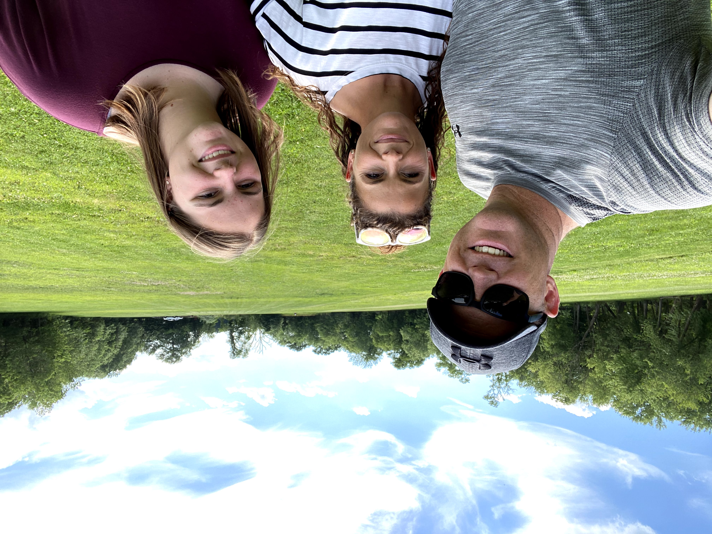

I'm not sure if this is Haun's Mill or Hawn's Mill. I've seen it spelled both
ways on the church website and in different areas. This was really out of the
way. We had to take some dirt roads through farmlands to get there. If I were
not so confident in Google, I would wonder if we were in the right place. We saw
another family there that we met at the Independence visitor's center and a few
other places that were hitting all the same spots. He pulled in right after us
and said he wondered if he was going the right way!

There was not much to see here. There was just a big open grass field. This
place is significant to us though because Rachel's 4th great grandfather, Isaac
Laney, was shot 17 times I believe in this location and lived. Unfortunately,
there were many saints that were killed in the incident now known as the Haun's
Mill Masacre.

We were lucky that the landscape crew was there mowing the large field when we
arrived. The landscrape crew are basically full-time missionaries. One of them
stopped to talk to us and she told us from very interesting details.

The property used to be own by the reorganized LDS church, but they never did
anything with it. They put it up for auction in 2012. A number of people looked
at it - probably for farm land, but nobody felt comfortable there. It still had
a very tangible evil feeling about the place. The church ended up purchasing it
and started cleaning it up and making it what it is today.

The person over the maintenance there never liked working out there. He always
felt uneasy and couldn't wait to leave. One day he went out there to work and
didn't fell any of that uneasiness but didn't think much of it. Someone asked
him later that day, "How was Haun's Mill today?" He said, "It was fine today
actually." They then told him that a couple members of the quorum of the twelve
had been out there that morning and blessed the land. Since that time it has
been much better. The sister missionary said she did have an uneasy feeling last
October while she was there and realized that was the time year that the
massacre occurred.

It would have been nice to go back into the woods and explore a bit more where
the mill was actually located. But the missionary warned us of ticks, so we
opted not to. It was a good thing. Once we got in the car we quickly checked for
ticks and Gracie found one on her ankle that had not done any damage yet.

The sister missionary also told me about a nice app called "Journey to Zion". It
has information about all these areas with some audio recordings teaching about
the areas and the history. It was good to listen to on our long drive to the
different areas. More people should know about it when doing a self-guided tour!

One last detail she told me that I found interesting was about Adam-Ondi-Ahman.
The church owns a lot of land in that area. It started out with about 27 acres
then they just kept purchasing as other land became available. Now they own
hundreds of acres there. They lease much of it out to farmers who grow crops or
graze cattle. They used to do 5-year leases. Recently they changed their policy
to only do 2-year leases.

I was really glad we had the Jeep for this portion of the tour. The road was
pretty muddy in some spots. We were told that the area gets very flooded and
often people drive all the way out there and never get to see the place because
it is completely flooded an there is no way to access it.

### Adam-Ondi-Ahman

This place was probably the most interesting to me. It really was a huge area.
We started by driving to Spring Hill, then on to Tower Hill. This was my favorit
place. There was something really unique and special about this area. It was
like being in the temple. I didn't want to leave. I just kept thinking aboutt
the history there, that Adam had been there, and this is where he built his
alter where he offered sacrifice. I thought about the future there and if I
would be there for the great event where those who help priesthood keys give an
accounting to Adam and he returns those keys to the Savior. It really was a
special place!

We left there around 5:30. We were going to stop in Jamesport to eat. It is a
little Amish community. Unfortunatly, I had my map set to Trenton and drove
right past it. So we ended up eating in Trenton. There were not a lot of options
here. We found a Mexican restaurant that turned out to be pretty good.

Rachel was nervous about what hotel we would find here. Our hotel in
Independence was not so great. It smelled bad too. She was pleasantly surprised
with the hotel I round here. It looks pretty new and has all the amenities you
would expect in a city hotel. So we are fortunate to have found this place. It
is the nicest hotel room so far.

It has been interesting visiting all these small towns. There are so many
churches everywhere - except for our churches. I have not seen many LDS chapels,
which surprises me for the rich history here. I wonder what percentage of the
population in Missouri know about the "Mormon" history here. I wonder how many
have any idea what will take place here in the future. My guess is not many -
hardly any outside of the membership of the church I suspect.

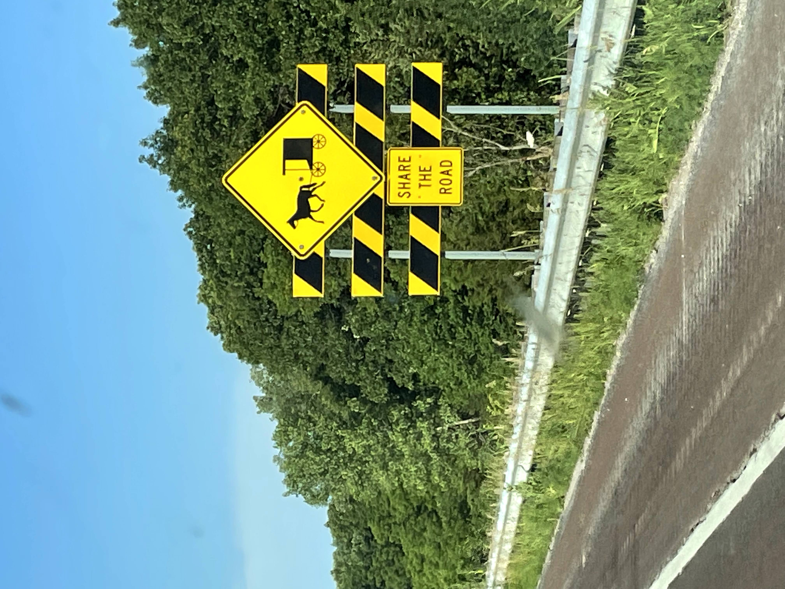

## Day 4 - Wednesday

We woke up around 5:40 and left our hotel about an hour later. It was a
beautiful 3-hour drive to Carthage/Nauvoo. It was fun to see Amish horse and
buggies all over the highway. I guess I don't understand why they can't drive
cars. One thing that confused us was seeing a young Amish guy sitting in a buggy
staring at his smart phone. I guess some technologies are OK? I'm not judging,
just curious.

### Carthage Jail

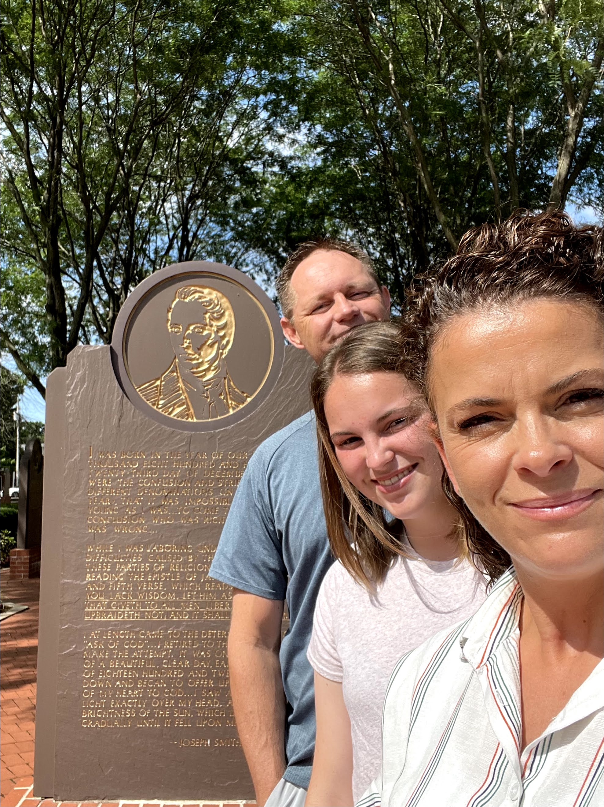

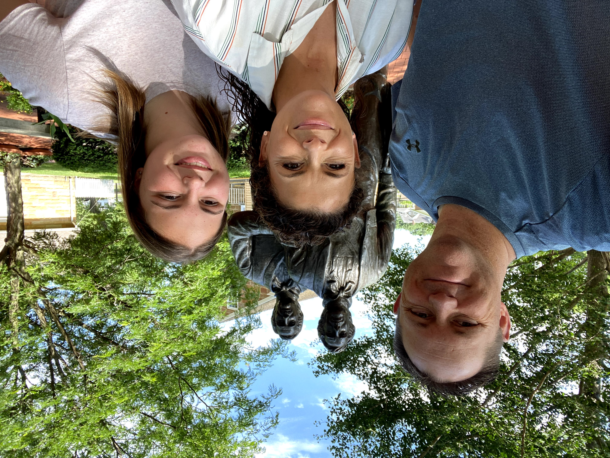

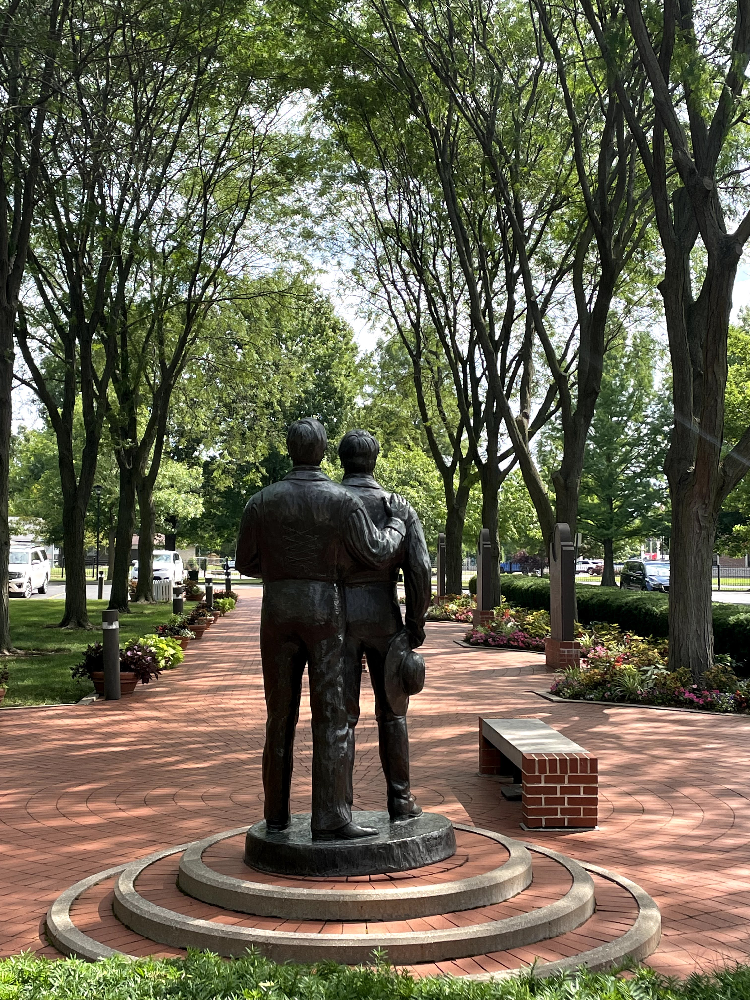

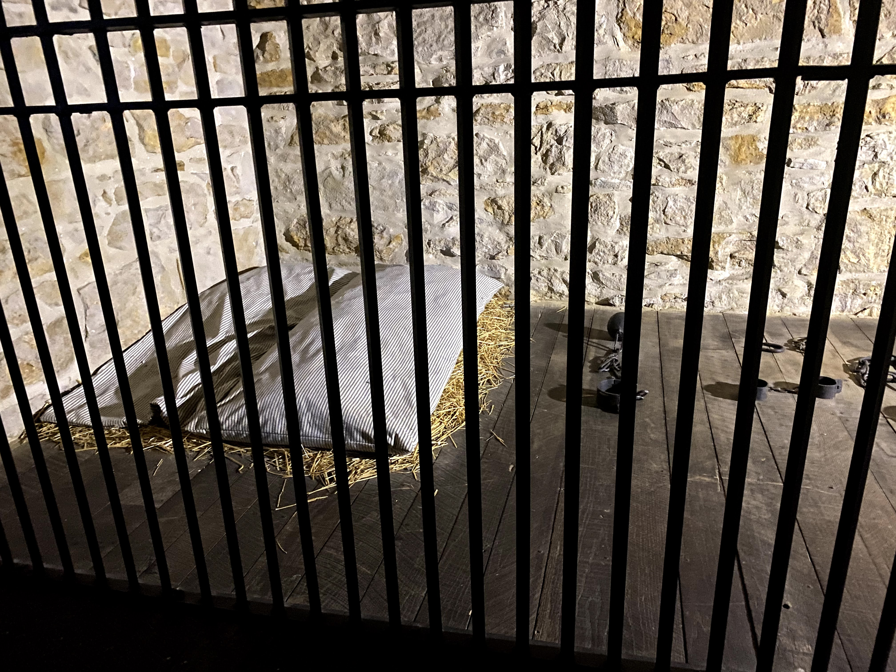

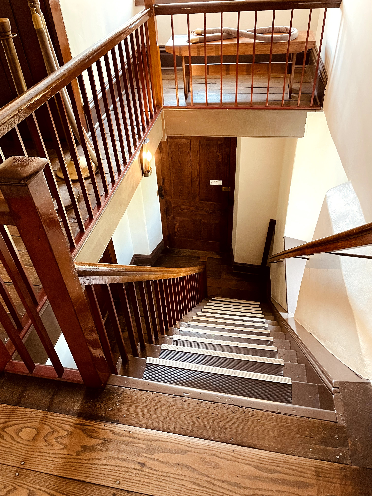

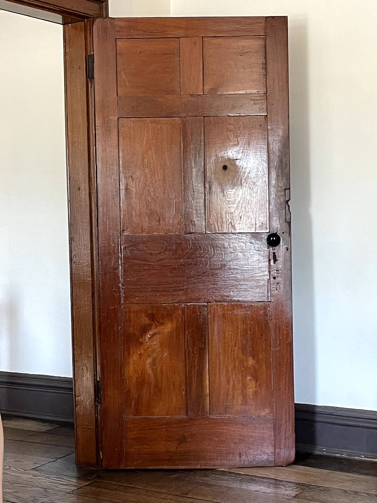

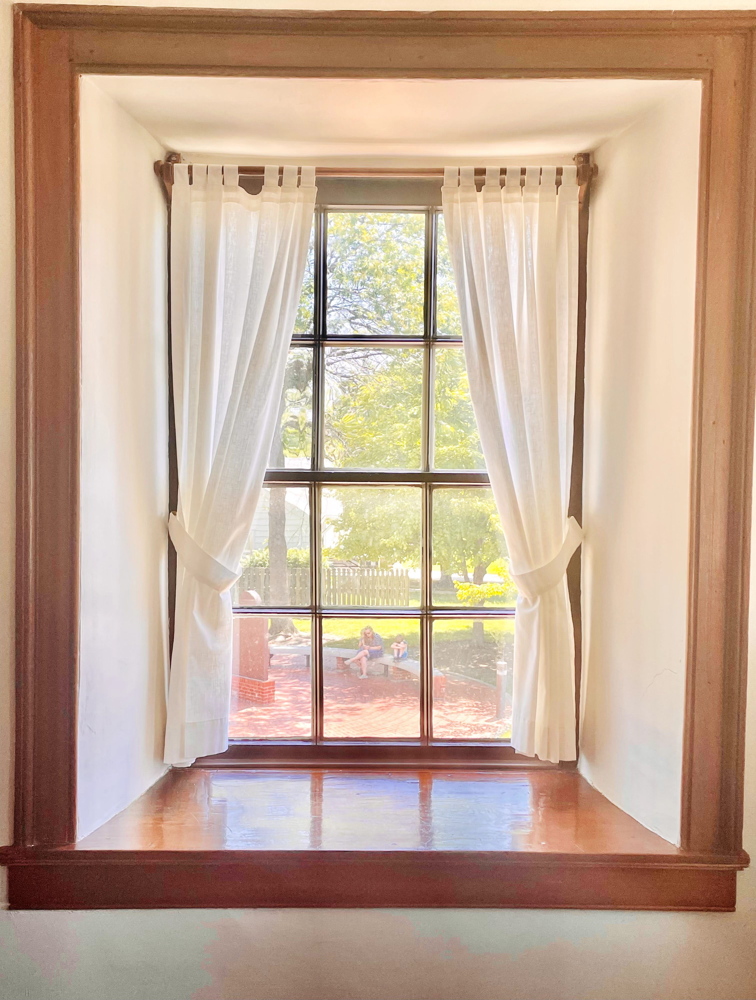

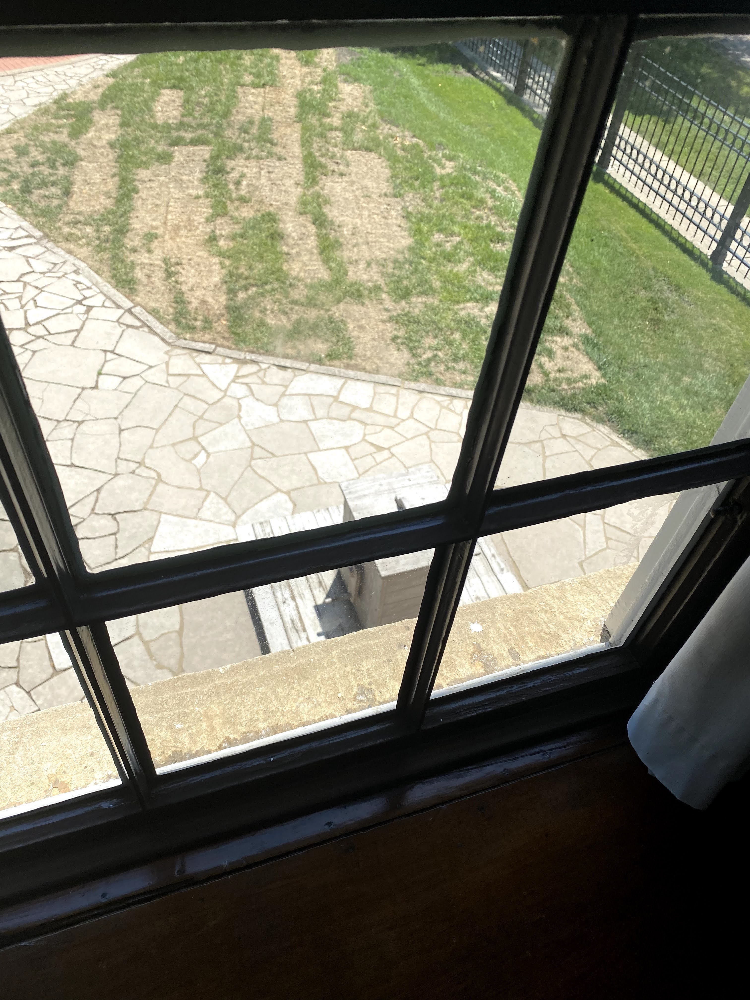

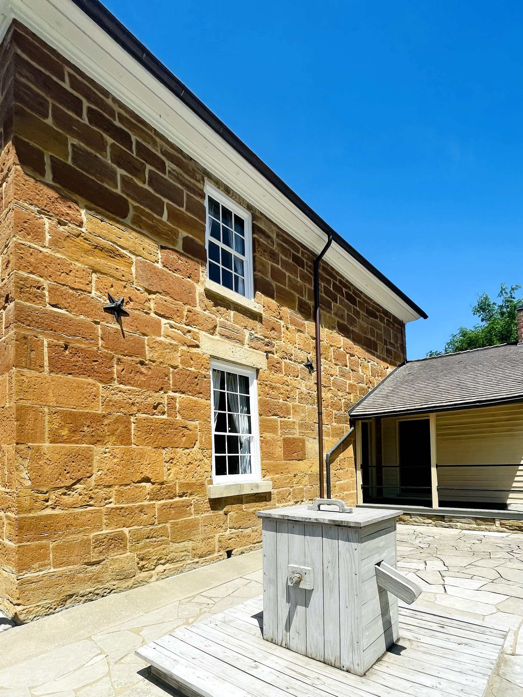

We arrived at Carthage Jail just before 10 A.M. I thought our appointment was at
10 AM but it was really at 11:00. It was fine though as it was a nice peaceful
place to hang out. I guess it was surprising to me how peaceful it was based on
what happened there. I guess it is similar to the Haun's Mill area. I'm sure the
area has been blessed and dedicated. I thought I might have a hard time being
the place where Joseph was killed. I LOVE Joseph Smith. I almost feel or at
least hope, that had I lived and been a similar age to him, we would have been
great friends and I would have tried to be around him as much as time would
allow - much like Brigham Young or Heber C. Kimball.

I asked Gracie and Rachel what their favorite place was so far. They both said
Carthage Jail. I would agree. I was most excited to do that tour. It is surreal
to know I walked where Joseph once was. I stood at the window where he was shot!
I saw the actual bullet hole in the door that killed Hyrum. It was a place I
have seen so many time in videos and pictures, so it was amazing to actually be
there.

### Nauvoo

We arrived in Nauvoo around 12:30 and stopped to eat at a small join that had
some decent burgers and some good ice cream treats called "Bricks". We then went
our on first scheduled event, which was a ride on oxen carts.

It is funny that I learned something I never knew. An ox is basically a cow!
Oxen are bovine that are used for work. That is it. So the only difference
between a steer and an ox, is that the ox is put to to work. Also, oxen
generally have horns or else the yoke will just slide off their heads, so that
is important.

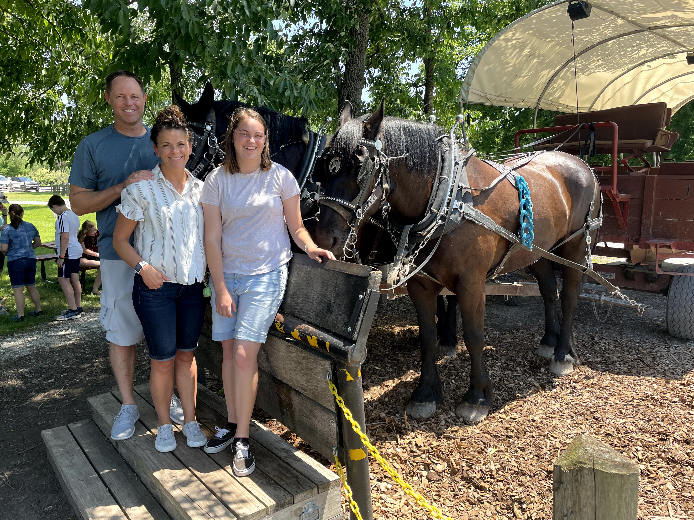

After our short ride on the oxen cart, we took a horse drawn carriage ride
around Old Nauvoo to learn about differnt buildings in the area. That was a
great place to start to get an overview of everything.

We had a bit of time so we went to our airbnb and took our luggage in. We are
sting in a home that has a shared room. So we have a private room and bathroom,
but we share the kitchen and hallway with others. It is and older building that
has been updated a bit, but it does hae dirty carpets and a funky smell. The
people staying in the other room brough a bid dog with them so I can how it may
have the dirty carpets and smells. The locaton is great though as it is close to
everything. There is not a whole lot of options in Nauvoo. I'm surprise at how
small this town is. If I were to campare it to to what I know, it feels smaller
than Duchesne and Midway. Maybe like an Altamont or Neola but a bit bigger. But
I haven't been to those areas in 25 years, so I don't know how they compare now.
In any case, for how big this area was when the saints lived here, it is sure
small now. I think the Saints that come to visit here provide much of the money
that passes through this town. It is amazing they have a temple. But I have
heard that the temple was build because a private donor paid for the expenses to
build it. Otherwise, it would not have happened.

We had an appointment after that to do a walking tour of "Temple City".
Unfortunately, we had no idea where to go. The website and my reservation email
didn't really say. It did say to check in at the place that was closed. We ended
up going to the visitors center to figure things out and learned we check in
there but go to a differnt place to start the tour. It is pretty confusing still
and I wish the website and email notification had more info because even after
they explained things they gave me some wrong information and we nearly missed
our next tour of the prophets' homes.

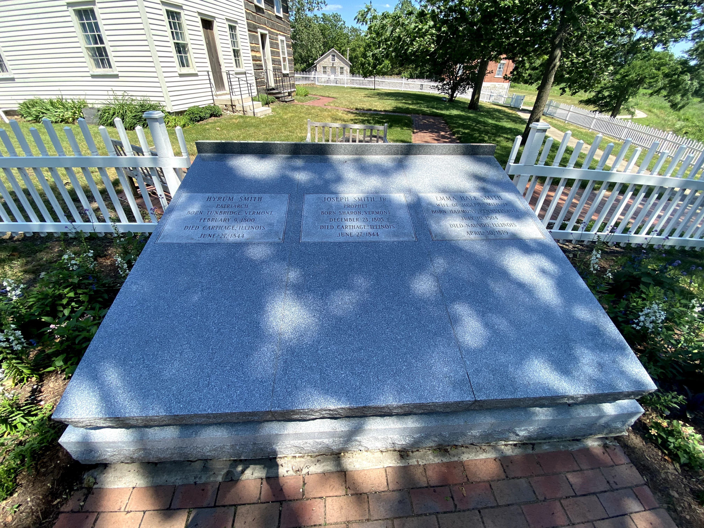

That was a nice tour where we got to walk through the homes of Orson Hyde, Heber
C. Kimball, and Wilford Woodruff. I took a lot of photos that may not be
interesting to many people, but will help me remember what I saw and bring back
memories at lest.

The last event of the night that we went to was a play put on by youth
performers called Sunset at the Mississippi. It is also funny to me that it
never occurred to me that Nauvoo bordered the Mississippi River! It was a fun a
event.

Some of the performers we we met this morning at Carthage. I learned another new
thing. They have 3 month performance missions where youth ages 18-25 can
audition and serve these 3-month missions here where they spend the summer doing
these performances. It doesn't replace a full-time mission, but I thought it was
a neat and interesting opportunity for those youth who are interested in that
sort of thing.

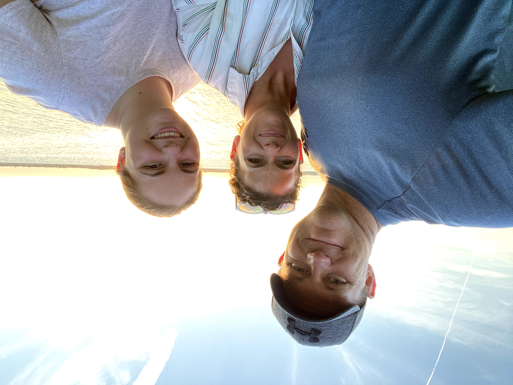

The performance ended around 8 pm. There is really no place to eat in Nauvoo at
that time. We ended up driving to Hamilton Iowa to get some fast food at Wendy's
and McDonalds. That's right, we stopped at both because Wendy's was out of
fries, and how can you eat a frosty without fries?

## Day 5 - Thursday

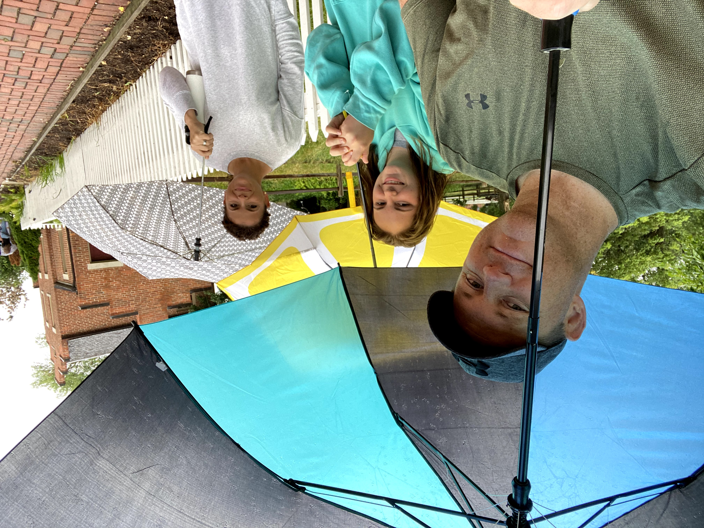

We woke up to rain this morning. Lots of it. I couldn't even see the sidewalk in
front of our house because it was under water. I went to the Dollar General,
which I would say is the biggest store in town, and found a few umbrellas. We
would need them for our tours.

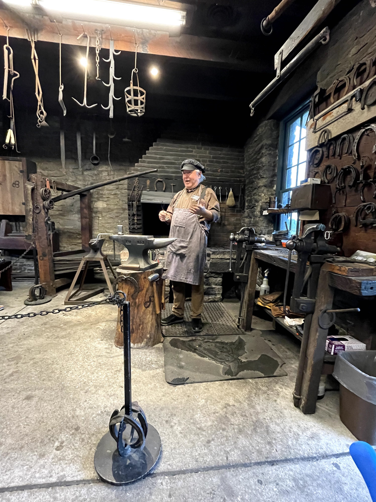

We took them to our first tour, which was the Pioneer trail. There we learned
about Brigham Young's home, the blacksmith, and the Seventies Hall. It was a lot
more interesting than I anticipated. The Blacksmith was great and very
entertaining. He gave us all miniature horeshoes that he made there.

While walking down the street there was an ox in the middle of the road. I had
read in Brigham Young's home that oxen should be 4-10 years old to make the
trek. I was told by one of the missionaries the the ox on the road was only two
years old. I said, "Wow, he is not even old enough to go on the trek." I said it
jokingly because it was HUGE. He said that the reason they wanted them at least
4 years old was because by then they are fully grown and don't eat as much. He
was still feeding that one a lot of grain. After 4 they don't require grain
anymore and just eat grass. I thought that was interesting information.

After our first tour we went into town to find some breakfast - or Brunch. It
seemed everythong on the main road was closed. I don't know where people eat
around here! We ate at The Red Front again. We also stopped at the fudge store
for some treats.

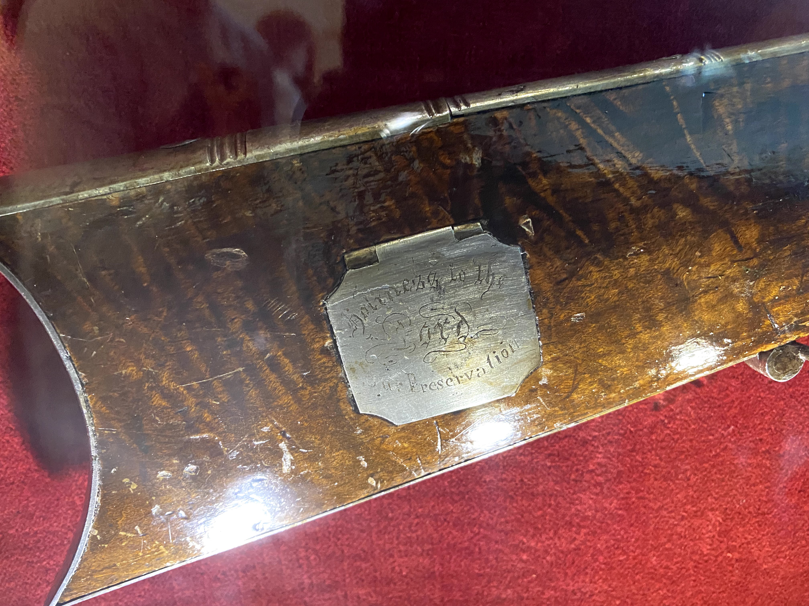

After eating we did another guided tour. This time we went to Main Street trades
where we toured the bakery, tin shop and Browning gun shop. I think my favorite
part of that was the Browning guns.

Following that tour, we took another carriage ride. This was was more in the
back woods while a missionary told stories. The missionary was Elder Davies from
Duchesne. This time I learned a little bit about myself. He said he served his
mission in Wales. While there everyone called him Elder Davis because that is
how they pronounce it there. When a lot of Davies came to America, the school
teachers had them drop the e based on how they pronounced their name. I went
back and checked and sure enough Gad Davis who moved here from Wales was born to
Thomas Davies. So I'm sure I am related to Elder Davies somehow. In any case, it
is cool that he is from Duchesne. He has the Uintah Basin drawal accent.

After this ride we ran back into town and stopped at the Dollar General to get a
few snacks for the road trip tomorrow.

We then went back to the Visitor's Center for a performance called The Promise.
This was a play by the performance missionaries. I got really tired and nearly
fell asleep a few times. I was touched at the then end of the show based on the
events. I later asked Gracie what her favorite part of the day was and she said
it was this performance.

After the performance, we took another tour, This time we visited the Riser shoe
shop and the printing press. Again, it was more intersting that I would have
imagined.

It is hard to remember the order of everything we did because it was go, go, go
all day long.

Following that tour we did one called Temple City, where to toured the home of
an architect and a few other prominent members. These homes where recreated
rather than restored. They were much nicer. In fact everything on this tour
seemed brand new. From what I understand, it baically is new and Elder Cook
recently dedicated these buildings.

This was our final tour and we pretty much hit them all from what I understand.
We had some "free" time after this so we went up to the temple and took some
photoes and walked around the temple grounds. We then went to a few souvinirs on
main street. Gracie had been wanting to do this the whole time so luckly they
were still open.

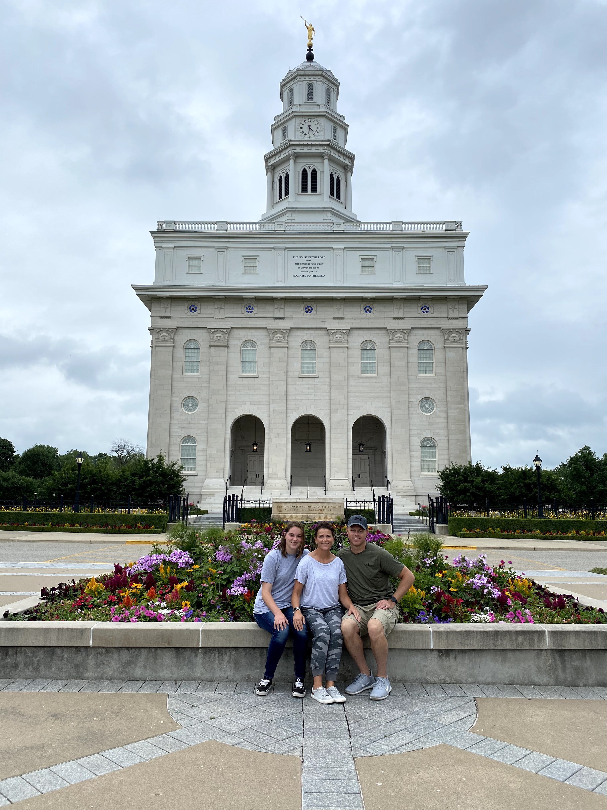

Again we tried to find somewhere to eat and we ended up at the same place for
the third time. I really don't know where everyone goes to eat if not at The Red
Front! They don't have a very big menu so it could get old fast.

After dinner we drove to Casey Hall's home. He gave me some drawings from his
kids to take to his parents in Brigham City. That will be fun to deliver those
to them.

Our final event of the eventing was at 8:30 called the Trail of Hope. This was
supposed to be performed on Parley's Street, but it was raining a bit, so they
moved it into the Visitor's Center auditorium. It was good, but I wish it would
have been on Parley's street for the full experience.

After it was over we drove to Parley's street again and walked up it. There were
fireflies or lightning bugs everywhere. I even caught one and it was walking all
over my hand and sparking. I named it Sparky before I let him go. We also saw a
baby deer and on the way back we saw a couple of racoons.

## Day 6 - Friday

We got up early and left Nauvoo around 6:30 AM. Our goal was to be in St. Louis
by 10:00 AM to see the art museum before flying home. It was pretty rainy drive
the whole way until we actually got to St. Louis. We made it just before the
museum opened.

Like the zoo, it was also free. There was a lot to look at. Honestly, it was
poor way to end the trip. Compared to everthing I saw and felt in Nauvoo, the
art museum was a completely different feel. It felt dark. There were a handful
of paintings I enjoyed, such as some Monet's and Gogh, but overall, I was just
ready to leave and get out of there.

We drove back to Alamo to return the car and took a shuttle to the airport where
we ate lunch and waiting for our flight.

## Afterthoughts

It has been a few days since being home and I thought I would just add a few
more thoughts about the trip.

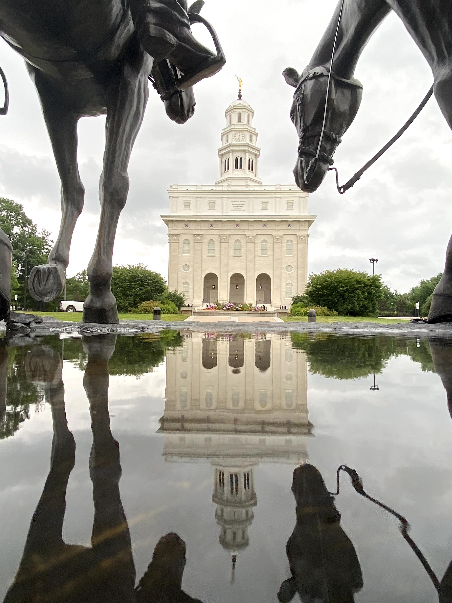

To be honest, I thought it would be "neat" to see some church history sites. It
was far beyond "neat". I can't even think of an appropriate word to describe it.
It affected me far more than I thought it would. I left my heart in Nauvoo. I
want to go back. Perhaps it was because we have excellent weather there and I
never experieced the heat that people complain about, or the cold winters I have
heard about. But I also can't stop thinking about the history there and feeling
like I was somehow a part of it - even though I don't think I have any direct
ancestors that lived there.

Sunday was the anniversary of Joseph and Hyrum's marterdom. 177 years ago they
were killed. My thoughts turned to them.

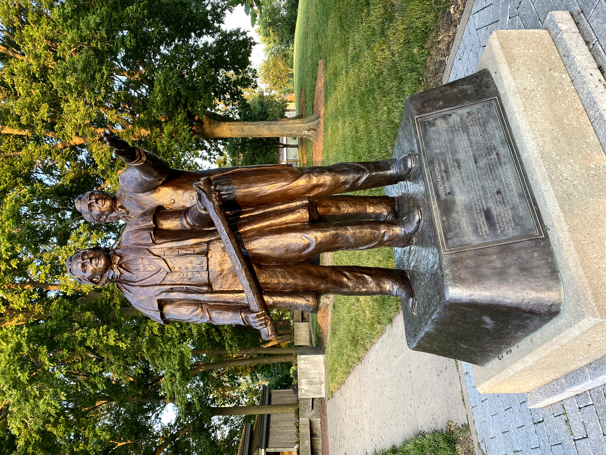

It also occurred to me that I lived in a town named after Joseph's successor who
led the saints to this area and established new settlements that are even
greater than Nauvoo.

For more photos, visit: https://photos.app.goo.gl/kP99W9Raz6D42J4L8
