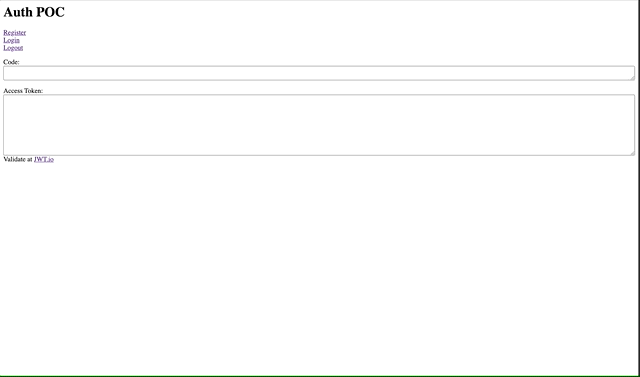

First Proof of Concept

When starting a new project, I often start with very small proofs-of-concept,
then turn those POCs into my working solution.

When I create a new site, I like to start with designs and then wire everything
up. [Luke](https://www.lukelarsen.com/) is working on all the designs of what
the site will look like so I don't have any of that yet. But there are still
some things I can do and figure out while I'm waiting.

The first proof of concept I want to work toward is authenticating a user and
getting the JWT token.

With this POC, this is the simple test plan of what I want to accomplish:

1. Register a user.
1. Log in as a user
1. Get JWT
1. Log out user

At this point, I'm not concerned with frameworks or anything else. I'll create a
simple HTML file with inline JS and use browser-sync to serve it.

To get over CORS issues, I had to set "Web Origins" to `+` on the `hasura`
client in KeyCloak.

Here is the content of my simple HTML file with inline JavaScript:

```html
<html>
  <head>
    <title>Auth POC</title>
  </head>
  <body>
    <h1>Auth POC</h1>
    <a
      href="http://localhost:8081/auth/realms/pickleballevents/protocol/openid-connect/registrations?client_id=hasura&response_mode=fragment&response_type=code&redirect_uri=http://localhost:9000/index.html
"
      >Register</a
    ><br />
    <a
      href="http://localhost:8081/auth/realms/pickleballevents/protocol/openid-connect/auth?client_id=hasura&response_mode=fragment&response_type=code&login=true&redirect_uri=http://localhost:9000/index.html"
      >Login</a
    ><br />
    <a
      href="http://localhost:8081/auth/realms/pickleballevents/protocol/openid-connect/logout?redirect_uri=http://localhost:9000/index.html"
      >Logout</a
    ><br />

    <p>
      Code:<br />
      <textarea id="code" style="width: 100%"></textarea>
    </p>

    <p>
      Access Token:<br />
      <textarea id="token" style="width: 100%; height: 144px"></textarea>
      Validate at <a href="https://jwt.io/">JWT.io</a>
    </p>

    <script>
      const queryString = window.location.href.split('#')[1]
      const keyvals = queryString.split('&')
      let params = {}
      keyvals.forEach(s => {
        kv = s.split('=')
        params[kv[0]] = kv[1]
      })
      console.log('params', params)

      if (params.code) {
        document.getElementById('code').value = params.code

        // fetch token
        const urlencoded = new URLSearchParams()
        urlencoded.append('grant_type', 'authorization_code')
        urlencoded.append('client_id', 'hasura')
        urlencoded.append('redirect_uri', 'http://localhost:9000/index.html')
        urlencoded.append('code', params.code)

        const requestOptions = {
          method: 'POST',
          headers: {
            'Content-Type': 'application/x-www-form-urlencoded',
          },
          body: urlencoded,
        }

        const url =
          'http://localhost:8081/auth/realms/pickleballevents/protocol/openid-connect/token'
        fetch(url, requestOptions)
          .then(response => response.json())
          .then(result => {
            console.log('🍀Success:', result)
            if (result.access_token) {
              document.getElementById('token').value = result.access_token
            }
          })
          .catch(error => {
            console.log('👹Error:', error)
          })
      }
    </script>
  </body>
</html>
```

I have a shortcut for serving HTML files with browser-sync:

```shell
alias serve=browser-sync start -s -f . --no-notify --host  --port 9000 --directory
```

Then I can just cd into any directory and type `serve`.

Here is a gif showing the working POC:



Next POC, I'll want to try to
[run a query in Hasura with my JWT](poc-use-key-cloak-jwt-to-authorize-hasura-queries).
