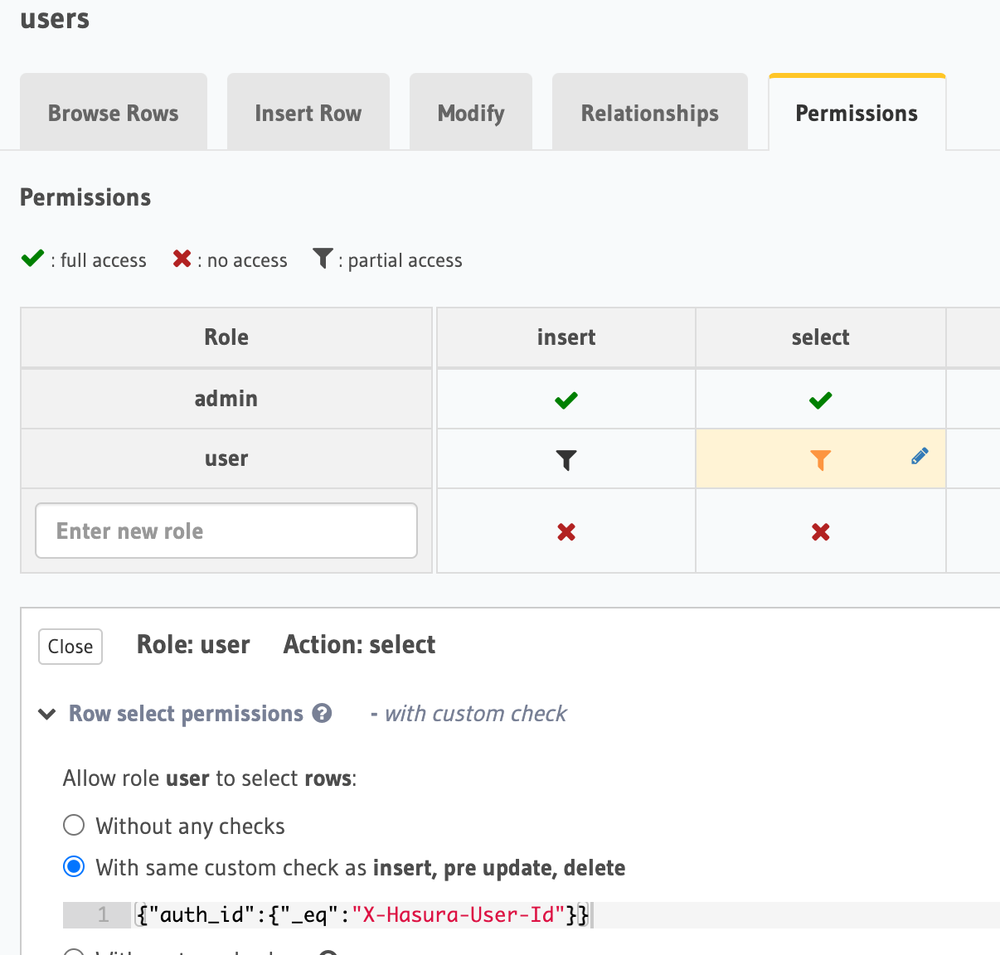
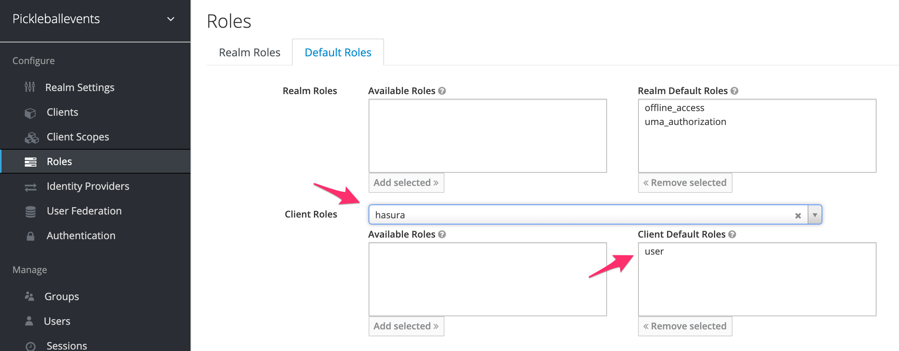

Building upon
[my last proof-of-concept](authenticate-with-key-cloak-and-get-jwt), I now
wanted to use my JWT from KeyCload to authenticate with Hasura.

Thankfully, this went pretty smoothly. I already had a user table configured in
Hasura that I migrated from my last project. It is set up to allow a user to
only query his/her user record.



After logging in with KeyCloak, I ran a simple query to get all users to ensure
it only returned the logged-in user.

```js
function getProfile(jwt) {
  const gql = `
				query MyQuery {
					users {
						id
						email
						first_name
						last_name
						last_seen
						name
					}
				}
			`
  fetch('http://localhost:8080/v1/graphql', {
    method: 'POST',
    body: JSON.stringify({
      query: gql,
    }),
    headers: {
      'content-type': 'application/json',
      Authorization: `Bearer ${jwt}`,
    },
  }).then(async data => {
    // Console log our return data
    user_data = await data.json()
    if (user_data.data.users.length) {
      document.getElementById('user-data').innerHTML = JSON.stringify(
        user_data,
        null,
        2,
      )
    } else {
      createProfile(jwt)
    }
  })
}
```

Next, I wanted to register a new user and have it create a user record in
Hasura. To make this work, I had to set up KeyCloak to give all newly registered
users the `user` role by default. I did this by going to Roles ->
default-roles-{realm} -> select `hasura` client -> add `user` to the Client
Default Roles.



Now when a user registers, their JWT will have the user role needed to make
queries.

But, I need to create their profile if it does not exist. So I wrote a query to
add a new user profile if one is not found after registering. It looks like
this.

```js
function createProfile(jwt) {
  const gql = `
				mutation AddUser($auth_id: String!, $email: String!, $given_name: String, $family_name: String, $name: String) {
					insert_users_one(object: {auth_id: $auth_id, email: $email, first_name: $given_name, last_name: $family_name, name: $name}) {
						id
					}
				}
			`
  const decodedJwt = parseJwt(jwt)
  fetch('http://localhost:8080/v1/graphql', {
    method: 'POST',
    body: JSON.stringify({
      query: gql,
      variables: {
        auth_id: decodedJwt.sub,
        email: decodedJwt.email,
        given_name: decodedJwt.given_name,
        family_name: decodedJwt.family_name,
        name: decodedJwt.name,
      },
    }),
    headers: {
      'content-type': 'application/json',
      Authorization: `Bearer ${jwt}`,
    },
  }).then(async data => {
    // Console log our return data
    const resp = await data.json()
    console.log(resp)
    getProfile(jwt)
  })
}
```

And here is another gif of the POC workflow:


