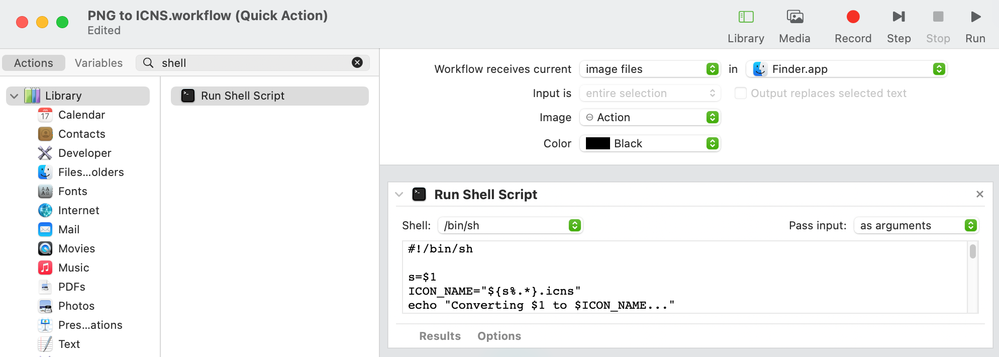

MacOS comes with the tools you need to convert PNG files to ICNS files. So here
is a little script that will help you convert quickly.

First, the script:

```shell
#!/bin/sh

s=$1
ICON_NAME="${s%.*}.icns"
echo "Converting $1 to $ICON_NAME..."

# Create an icon directory to work in
ICONS_DIR="tempicon.iconset"
mkdir $ICONS_DIR

# Create all other images sizes
sips -z 1024 1024 $1 --out "$ICONS_DIR/icon_512x512@2x.png"
sips -z 512  512  "$ICONS_DIR/icon_512x512@2x.png" --out "$ICONS_DIR/icon_512x512.png"
sips -z 512  512  "$ICONS_DIR/icon_512x512@2x.png" --out "$ICONS_DIR/icon_256x256@2x.png"
sips -z 256  256  "$ICONS_DIR/icon_512x512@2x.png" --out "$ICONS_DIR/icon_256x256x.png"
sips -z 256  256  "$ICONS_DIR/icon_512x512@2x.png" --out "$ICONS_DIR/icon_128x128@2x.png"
sips -z 128  128  "$ICONS_DIR/icon_512x512@2x.png" --out "$ICONS_DIR/icon_128x128.png"
sips -z 64   64   "$ICONS_DIR/icon_512x512@2x.png" --out "$ICONS_DIR/icon_64x64.png"
sips -z 32   32   "$ICONS_DIR/icon_512x512@2x.png" --out "$ICONS_DIR/icon_32x32.png"
sips -z 32   32   "$ICONS_DIR/icon_512x512@2x.png" --out "$ICONS_DIR/icon_16x16@2x.png"
sips -z 16   16   "$ICONS_DIR/icon_512x512@2x.png" --out "$ICONS_DIR/icon_16x16.png"

# Create the icns file
iconutil -c icns $ICONS_DIR

# remove the temporary directory
rm -rf $ICONS_DIR

# rename icns
mv tempicon.icns $ICON_NAME
```

Save this script as `png2icns` and make it executable (`chmod +x png2icns`). Put
this file in a directory listed in your system PATH.

Now, you can simply run the command from any directory in your terminal like so:
`png2icns exampleimage.png`. It will then generate a new file named
`exampleimage.icns`.

Let's take it a step further so you can also run the command by right-clicking
on a png image in your finder. If you don't want to go set this up manually, you
can download and import [my workflow here](./downloads/workflow.zip).

Open **Automator** and create a new quick action. Set the following options in
the screenshot below:



Add the `Run Shell Script` action. I used `/bin/sh` as my script. You will need
to pass input **as arguments**.

Then just paste in the script above and save the workflow as "PNG to ICNS" (or
whatever you prefer).

You should now be able to right-click on an image and select Quick Action -> PNG
to ICNS. Your `icns` file should show up in your folder.


