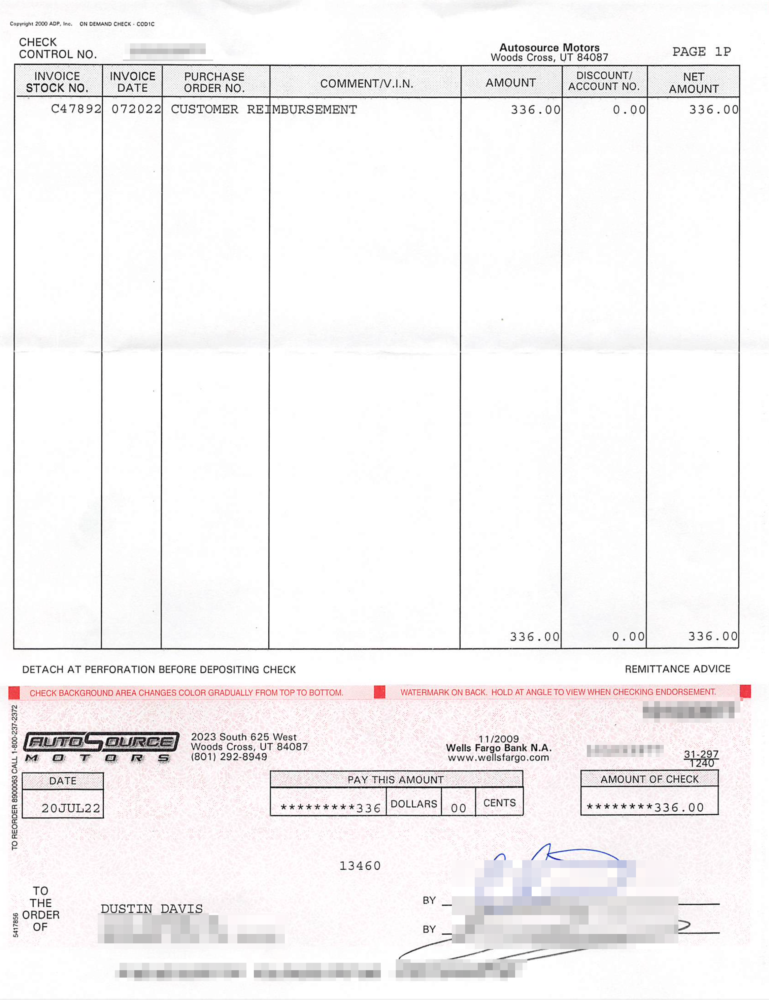
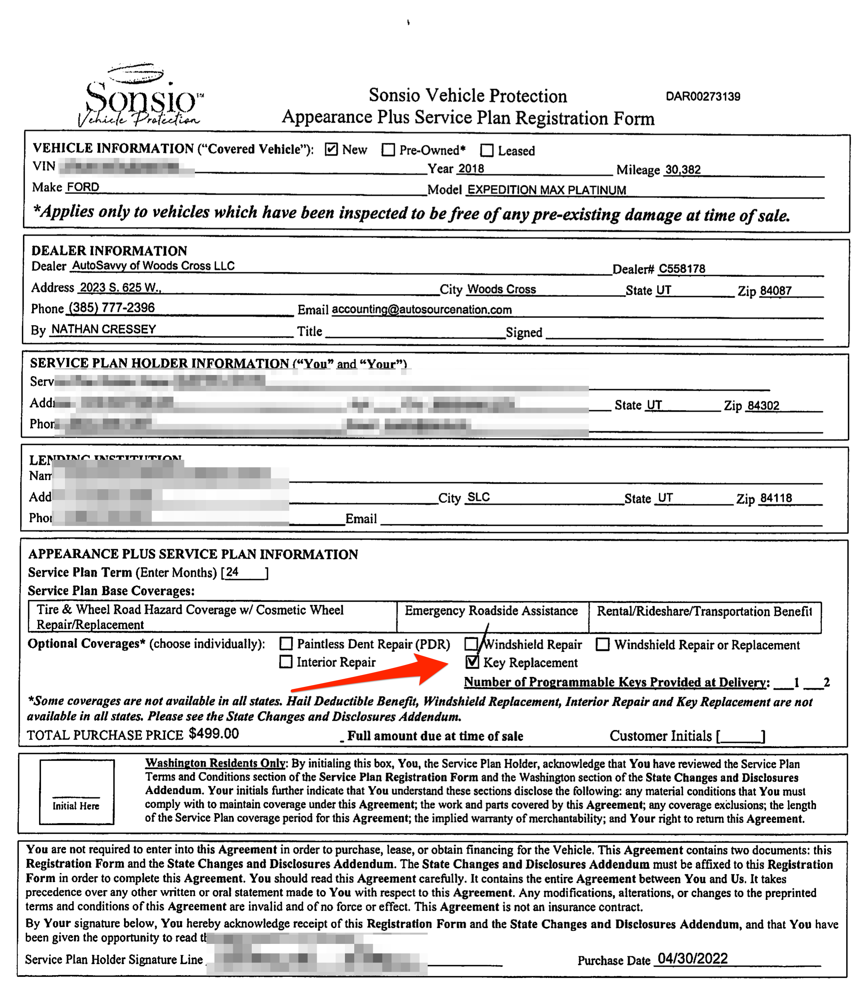

The following is a review I posted two months ago on Google:

> Let me share a tale of sadness and frustration of first-world problems.
>
> We had a 2018 Ford Expedition Max. We liked it but we also have an INFINITI
> Q70. My wife wanted a QX80. We found a 2019 model we liked and purchased it at
> the Draper location.
>
> Because the 2019 model doesn't have Apple CarPlay support, I had an
> after-market system installed that worked with the existing system. I spend
> over $2,000 to get that installed. Everything was great for a couple of months
> but then we started having engine problems. It was making loud noises and
> having trouble accelerating. We could barely make it up the hill to our home.
>
> I took it to a local place in Brigham City. I had to wait a week to be seen,
> but that was the soonest I found anyone could get me in. They said it had way
> to many check engine codes and suggested we take it to an INFINITI dealer. So
> I took a day off of work to drive it to Tim Dahle INFINITI in Murray. Once
> they started digging in to look at things they started asking questions. "Have
> you taken this engine apart?" They said it looked like the engine was taken
> apart and was missing a piece when it was put back together, which may have
> completely ruined the engine.
>
> So I called AutoSavvy because I was told that there was no engine damage and
> no work was done on the engine. I was told that they were 2-3 weeks out on
> service and if I had Tim Dahle fix it they could reimburse me. When I got a
> quote from Tim Dahle, it was over $10,000. When I sent this quote to
> AutoSavvy, I got a phone call saying that they could fix it for around $7,000
> so they asked me to take it to their Woods Cross location.
>
> I paid Tim Dahle $400 for the diagnosis and to put it all back together and
> took it Woods Cross.
>
> The next two months were a nightmare! I would call about once a week to get a
> status. Often no one would answer so I would leave a message. But nobody would
> return my call, so I would keep calling. When I did get someone on the phone
> they said they would check the status and call me back. But then they would
> never call me back. In that time we had to cancel spring break plans because
> we didn't have a vehicle and we had to drive two vehicles to various places
> when needed (not fun with these crazy gas prices).
>
> After about a month and half I took another day off of work to drive there and
> talk to someone in person. I still didn't get any answers. We had been out of
> our family vehicle all this time so we were looking for any type of solution.
> We offered to find another car to buy. This is when I met Val and he was the
> only person that seemed helpful there and would actually return my calls.
>
> Long story short, we traded in our QX80 for what we paid for it and purchased
> another 2018 Ford Expedition Max (unfortunately with all the Cam Phaser
> problems we had fixed on our previous 2018 Max). But it was a Platinum instead
> of XLT so it was a bit of an upgrade from our last Ford.
>
> During our time of frustration, AutoSavvy said they would pay for our monthly
> car payments for the QX80 (about $650 per month) for the 2 months it sat in
> the shop. That never happened.
>
> Now on to our new vehicle purchase...
>
> Within a week or two we noticed problems. It was making a growling noise and
> having trouble on tight turns. We took it in to a Ford dealer and they found a
> problem with the front passenger wheel. AutoSavvy said they would cover the
> repairs. It was over $500 and we are still waiting for that reimbursement a
> month and a half later.
>
> Now, we are getting all kinds of errors on our dashboard. "Park Aid Fault",
> "Drive Control Malfunction Service Required", "Hill Descent Control Fault",
> "Electronic Limited Slip Differential Reduced Torque", "Pre-Collision Assist
> Not Available", "Service AdvanceTrac", and the ABS light on. I've tried to
> call, text, and email AutoSavvy with no response so far and I'm a little
> nervous about what is going on and how long it is going to take.
>
> - $2,000 Stereo can't use
> - $400 Tim Dahle service
> - $1,300 Car payments for no car
> - $550 Ford service
> - $7,752 price different of vehicles
> - $3,925 fees and warrantees on another vehicle
>
> I 100% regret buying from AutoSavvy last November.

Now, here are my updates since then...

AutoSavvy Fixed all the error codes that were spawning from a bad front bumper
sensor. After some complaints and reminders of past issues, they gave me another
loaner vehicle to use while our car was in the shop.

After asking for all the reimbursements that AutoSavvy said they would give me
(two months of car payments, Ford service repairs and Time Dahle diagnosis,
which totaled $2,250.00) they sent me a check for $336.00. When I asked why that
amount and what about the rest of it, they didn't respond.

When we purchased the vehicle, I decided to buy the extended warranty this time.
The vehicle only came with one key. Our salesman said that if we wait 3 months,
then call on our warranty, we could get a key replacement. So I did that. After
calling, all seemed to go okay, then the warranty rep called me back and said
that she made a mistake. I didn't actually have key replacement coverage. I sent
a copy of of our contract showing it marked and she said I would have to talk to
the dealership.

I called AutoSavvy and left a message. Of course, they didn't return my call.
They never do. So I called again this morning and go someone on the line. I was
simply told "Warranties don't cover key replacements".

I said, "But my salesman said that it would, and my contract says it does."

"Sorry sir, warranties don't cover key replacements."

So asked to speak with someone higher up and she transferred me to a sale
manager. I was just sent to voicemail though with no name of whom I was leaving
a message for. I don't expect to hear back based on all my past experiences.

No we have a few issues with our car. My wife has an appointment for this week.
I'm guessing that none of it will actually be covered under warranty. I've left
a message with AutoSavvy's service department to ask if it will be or if I need
to take it to them to have it covered. I haven't heard back there either. I left
that message last week.

## Previous AutoSource / AutoSavvy Experience

This actually wasn't my first experience with AutoSource / AutoSavvy. I
purchased a 2016 INFINITI Q70L from their Post Falls, ID location. Here is my
Google review from that experience.

> I purchased a car here yesterday and it was one of the worst car-buying
> experiences I've ever had. I worked with Sally and it was such a frustrating
> experience.
>
> It had some bumper damage from some kind of accident while on the lot after
> the initial repairs. They told me that I could have them fix it, have one of
> their Utah location fix it (where I live), or negotiate a discount to have it
> fixed myself.
>
> I told Sally I would like them to have them fix the bumper in Utah as they
> said they could. She came back after talking to a manager and said that
> actually they would prefer not to do that because the Utah location would just
> put us on the back-burner because they didn't sell us the car. (Wow, talk
> about selling out your own company). They offered to knock $300 off the price.
>
> I said, "you think it only costs $300 to replace a bumper on an INFINITI?"
> (she's the one that told me the whole bumper would be replaced). She said in a
> whisper voice, "I'm not supposed to tell you this, but it actually costs $500
> to fix, so I would counter-offer if I were you."
>
> I said I still think it cost more that $500 to fix. I looked up online and saw
> a bumper alone was $450. So I asked for $800.
>
> She went back to her manager and after a time came back and said the best they
> could do was take $600 off because they are already losing money on the car
> and they have people to answer to as well. Also, they have a customer in
> Michigan that wants to buy this car but "they really wanted me to have it".
> All of it sounded like a load of crap, but I agreed because I wanted to get on
> my way.
>
> Then she showed me my financing options. None of them showed the price I would
> be financing, just three payment options - all about $80+ per month more than
> I had estimated. I asked where she was getting the numbers from because they
> didn't compute to me based on the price of the car and the down payment. I
> asked to see real numbers and what all the fees are.
>
> She left and came back, but still didn't have all the numbers. So she left
> again and finally showed me a breakdown of all the fees. I think they were
> just trying to add on an extended warranty without telling me or something,
> because the 3rd time the monthly payment looked more like what I was
> expecting - much less than the original numbers she put in front of me.
>
> They really tried to push their warranty on me, but is was $3200. I declined
> it.
>
> Once we finally agreed on the final price and numbers I sat around for another
> 30 minutes waiting to close the deal with Conner. Again he put the warranty
> options in front of me to make sure I didn't want them and had me sign the
> paper to say I declined them.
>
> PRO TIP: If you do want the warranty, I recommend you say no the first three
> times because after I signed this paper, he printed another paper that offered
> all the same warranties discounted up to $1300. I probably would have
> purchased at that price, but at this point I declined on principle because
> this was such a SLEAZY thing to do. I HATE these type of gimmicks.
>
> I was charged a fee for "Theft Protection" for $359 that I was never given the
> option to decline. I never would have purchased something like this. I'm
> guessing this was their way of getting part of that $600 discount back.
>
> The car has some problems that I didn't discover while test driving. The A/C
> seats don't work and the middle speakers on the seats don't work. Parts of the
> car don't quite line up from the repairs, but it is understandable. I wasn't
> expecting perfection from a rebuilt title.
>
> I like the car, but the whole buying experience was the worst. I had just
> purchased a family car 3 weeks ago from a used dealer in Salt Lake. By
> comparison, that was a 5-star experience. The sales person was honest and
> completely transparent and I was in and out in 30 minutes and I was able to
> use my own credit union without all the excuses like "this is the only credit
> union that will work with us on the rebuilt titles." Bull!

This car has been good, but I will tell you that I was going to live with the
bumper damage, but I didn't get to live too long with it.

My wife was pulling out of a drive way and the front bumper scraped the cement a
bit. A huge chunk of Bondo fell off and make it look horrible. Is it customary
to repair a bumper with Bondo?

We took it in and had it repaired and as I suspected, it was more that $600. It
was actually $1366.00 to have it repaired correctly.

## Stupid Tax

Stupid Tax is a term often used when you make a big financial mistake and just
have to learn from it. I figure there is more coming with repairs needed to our
Expedition right now, but so far, here is how much stupid tax I've paid by doing
business with AutoSavvy:

| Item                               | Amount      |
| ---------------------------------- | ----------- |
| Q70L Bumper                        | 766.00      |
| Theft protection                   | 359.00      |
| Car Stereo                         | 2,000.00    |
| Tim Dahle Diagnosis                | 🔴 400.00   |
| Car Payments/no car                | 🔴 1,300.00 |
| Ford Service                       | 🔴 550.00   |
| Having to Purchase Another Vehicle | 7,752.00    |
| Purchase fees and warranty         | 3,925.00    |
| New Key for Expedition             | 🔴 300.00   |
| AutoSavvy Reimbursement            | +336.00     |
| **Total Stupid Tax**               | **17,016**  |

Let me pay this stupid tax so that you don't have to! Buying from AutoSavvy is
just not worth the risk.

If AutoSavvy wants to try to make any of this right (particularly the
highlighted 🔴 items that I was told I would be reimbursed for), I'm happy pull
down this post and my change my Google reviews, but I'm not holding my breath
and I'm ready to move on.
